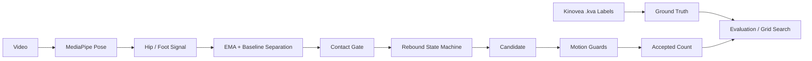
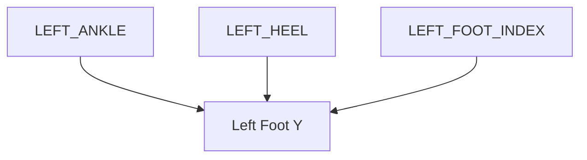
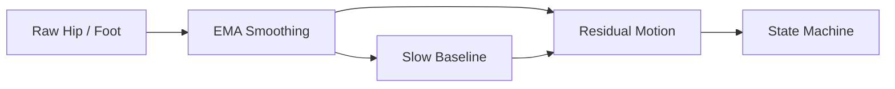
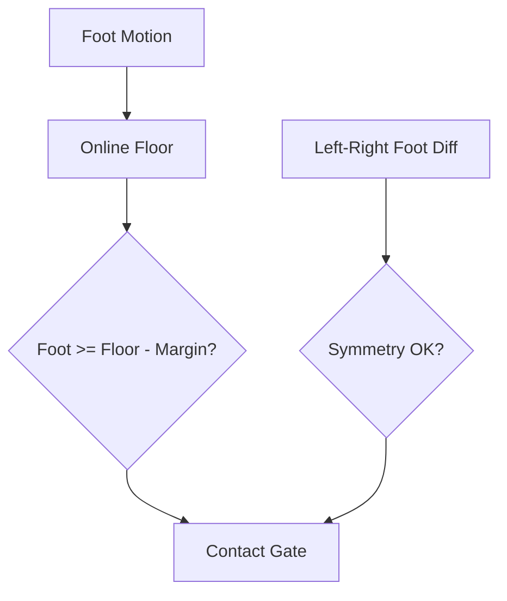
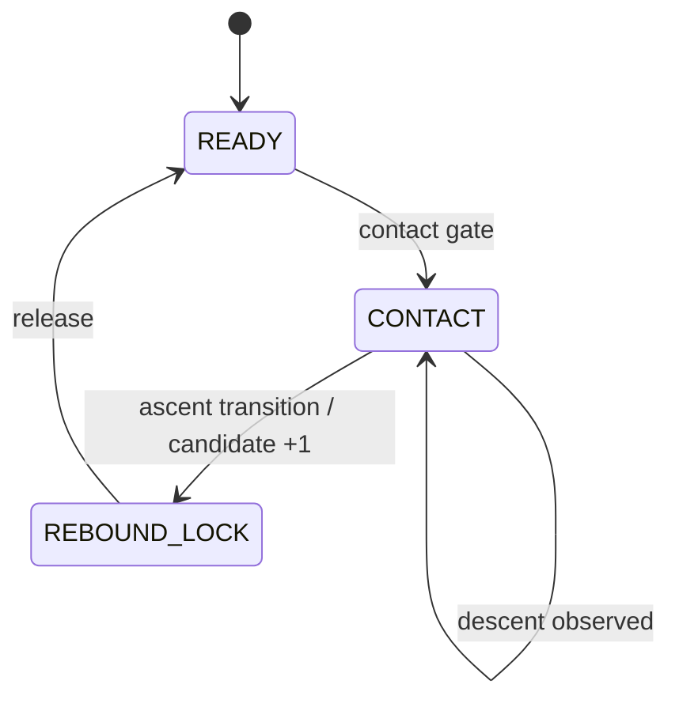
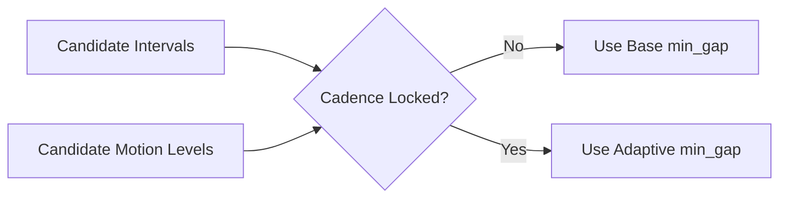
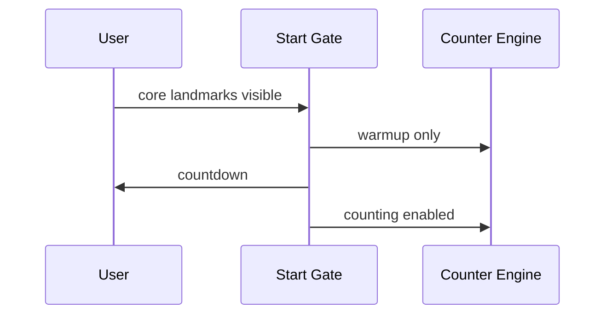
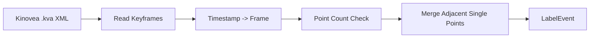
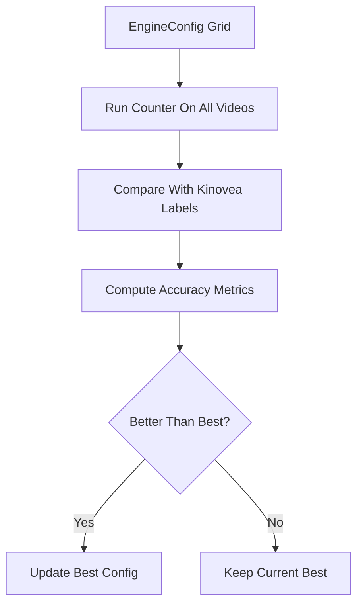

# 모아뛰기 측정에 사용된 기술 정리 노트

이 문서는 `basic_jump` 디렉토리에서 모아뛰기 카운트를 구현할 때 사용한 기술들을 번호 순으로 정리한 문서다.  
설명 대상은 주로 [basic_jump/counter_engine.py](/home/dongeon-yoon/jump-rope-detector/basic_jump/counter_engine.py), [basic_jump/run_dataset_eval.py](/home/dongeon-yoon/jump-rope-detector/basic_jump/run_dataset_eval.py), [basic_jump/README.md](/home/dongeon-yoon/jump-rope-detector/basic_jump/README.md)이다.

설명 전 중요한 전제 3가지가 있다.

첫째, 이 프로젝트는 모델을 새로 학습한 구조가 아니다. 
둘째, 사람 자세 추출은 MediaPipe Pose를 사용한다. 
셋째, 그 위에 규칙 기반 온라인 카운팅 엔진을 얹고, Kinovea 라벨 데이터를 이용해 검증하고 threshold를 튜닝하는 방식이다.

## 1. Pose 추출

- 입력 영상 프레임에서 MediaPipe Pose로 랜드마크를 추출한다.
- 카운팅에 직접 쓰는 핵심 랜드마크는 `hip`, `ankle`, `heel`, `foot index`다.
- 이 기술의 목적은 모아뛰기에서 몸 중심과 발의 상하 변화값을 안정적으로 얻는 것이다.
- 구현 위치:
   [basic_jump/counter_engine.py의 381번째 줄](/home/dongeon-yoon/jump-rope-detector/basic_jump/counter_engine.py#L381)

설정상 관련 수치:

- `min_detection_confidence = 0.5`
- `min_tracking_confidence = 0.5`
- `model_complexity = 1`

## 2. 유효 프레임 필터링

- hip visibility가 일정 수준보다 낮으면 해당 프레임은 사용하지 않는다.
- 좌우 발 랜드마크가 충분히 보이지 않아도 카운팅에서 제외한다.
- 이 기술의 목적은 랜드마크 품질이 낮은 프레임은 초기에 버려서 후단 상태기계가 랜드마크의 흔들림에 오염되지 않게 하는 것이다.
- 구현 위치:
   [basic_jump/counter_engine.py의 307번째 줄](/home/dongeon-yoon/jump-rope-detector/basic_jump/counter_engine.py#L307)

설정된 임계값:

- `foot_visibility_threshold = 0.35`
- `hip_visibility_threshold = 0.50`

## 3. 발 높이 통합

- 여기서 발 높이는 'ankle', 'heel', 'foot index' 를 묶어서 평균한 값을 말한다.
- visibility가 높은 발 랜드마크를 우선 사용하고, 부족하면 fallback 평균을 쓴다.
- 이렇게 해서 하나의 발 랜드마크가 흔들릴 때 생기는 노이즈를 줄일 수 있다.
- 구현 위치:
   [basic_jump/counter_engine.py의 295번째 줄](/home/dongeon-yoon/jump-rope-detector/basic_jump/counter_engine.py#L295)

## 4. 사람 크기 정규화

- 좌우 `hip-ankle` 길이를 평균하여 `leg_length`를 만든다.
- 대부분의 threshold는 `leg_length`로 나눈 ratio 형태로 처리한다.
- 이 기술의 목적은 사람 키, 카메라 거리, 촬영 구도의 차이를 줄이는 것이다.
- 구현 위치:
   [basic_jump/counter_engine.py의 332번째 줄](/home/dongeon-yoon/jump-rope-detector/basic_jump/counter_engine.py#L332)

설정된 하한:

- `leg_length` 최소값은 `0.05`

## 5. 평균 hip과 평균 foot 신호 생성

- 좌우 hip 평균으로 몸 중심 상하 움직임을 만든다.
- 좌우 foot 평균으로 양발의 접지 높이 신호를 만든다.
- basic_jump는 모아뛰기이므로 좌우 전환보다 양발 묶음의 반등 리듬(cadence)이 더 중요하다.
- 구현 위치:
   [basic_jump/counter_engine.py의 352번째 줄](/home/dongeon-yoon/jump-rope-detector/basic_jump/counter_engine.py#L352)

## 6. EMA 기반 smoothing

- raw hip, foot 좌표를 그대로 쓰지 않고 EMA(Exponential Moving Average, 지수 이동 평균)로 smoothing한다.
- 표준 EMA와 빠른 EMA를 둘 다 계산한다.
- 최근 interval이 짧아 빠른 리듬으로 판단되면 더 빠른 EMA를 써서 반응 속도를 높인다.
- 구현 위치:
   [basic_jump/counter_engine.py의 450번째 줄](/home/dongeon-yoon/jump-rope-detector/basic_jump/counter_engine.py#L450)

설정된 임계값:

- `ema_alpha_hip = 0.45`
- `ema_alpha_foot = 0.55`
- `fast_ema_alpha_hip = 0.25`
- `fast_ema_alpha_foot = 0.35`
- `fast_mode_cadence_threshold = 7` 프레임

## 7. 느린 baseline 분리

- hip과 foot 각각에 대해 느린 baseline을 따로 추적한다.
- 실제 상태기계는 현재 프레임의 y좌표가 아니라 baseline에서 벗어난 정도인 residual motion을 본다.
- 이 기술은 사용자가 카메라 앞뒤 혹은 옆쪽으로 서서히 이동하는 움직임으로 인한 거리 변화와 실제 점프 반등을 분리하기 위함이다.
- 구현 위치:
   [basic_jump/counter_engine.py의 468번째 줄](/home/dongeon-yoon/jump-rope-detector/basic_jump/counter_engine.py#L468)

설정된 임계값:

- `baseline_alpha_hip = 0.02`
- `baseline_alpha_foot = 0.04`

## 8. 바닥 영역(floor band) 추정

- 바닥 위치를 고정값으로 두지 않는다.
- foot residual의 상단 영역을 현재 바닥 근처라고 보고 계속 갱신한다.
- 이 기술은 `floor_decay_ratio(=decay)`를 두어 점프를 하는 동안 바닥 추정이 너무 급하게 변하지 않도록 돕는다.
- 구현 위치:
   [basic_jump/counter_engine.py의 475번째 줄](/home/dongeon-yoon/jump-rope-detector/basic_jump/counter_engine.py#L475)

설정된 임계값:

- `floor_decay_ratio = 0.004`

## 9. 접지 게이트

- 발이 바닥 영역 근처에 있는지 확인한다.
- 좌우 발 높이 차가 너무 크지 않은지도 같이 본다.
- 즉, “양발이 바닥 근처에 같이 있는 모아뛰기 접지 상태”를 gate로 만들어 count 후보로 넘기는 역할이다.
- 구현 위치:
   [basic_jump/counter_engine.py의 488번째 줄](/home/dongeon-yoon/jump-rope-detector/basic_jump/counter_engine.py#L488)

설정된 임계값:

- `contact_margin_ratio = 0.08`
- `symmetry_y_ratio = 0.12`

## 10. hip 속도 기반 하강/상승 전환 검출

- hip residual의 프레임 간 변화량으로 `hip_vel`을 만든다.
- 하강 구간과 상승 구간을 별도 threshold로 나눈다.
- 빠른 리듬에서는 `fast_descend_velocity_ratio`, `fast_ascend_velocity_ratio`를 사용해 threshold 기준을 완화한다.
- 이 기술의 핵심은 점프의 최고점을 세는 것이 아니라 접지 상태에서 하강 후 상승으로 바뀌는 첫 전환점을 세는 것이다.
- 구현 위치:
   [basic_jump/counter_engine.py의 472번째 줄](/home/dongeon-yoon/jump-rope-detector/basic_jump/counter_engine.py#L472)

설정된 임계값:

- `descend_velocity_ratio = 0.006`
- `ascend_velocity_ratio = 0.004`
- `fast_descend_velocity_ratio = 0.002`
- `fast_ascend_velocity_ratio = 0.001`

## 11. 상태기계 카운팅

- 상태는 `READY`, `CONTACT`, `REBOUND_LOCK`으로 구성된다.
- `CONTACT`에서 하강을 본 뒤, 다음 프레임들에서 상승 전환이 오면 후보 count(+1 카운트)를 만든다.
- 카운트 직후 `REBOUND_LOCK`으로 전환되어 같은 점프를 두 번 세는 것을 막는다.
- 구현 위치:
   [basic_jump/counter_engine.py의 426번째 줄](/home/dongeon-yoon/jump-rope-detector/basic_jump/counter_engine.py#L426)

설정된 임계값:

- `min_refractory_frames = 4`
- `fast_min_refractory_frames = 2`

## 12. 최근 interval 추적과 fast mode

- 최근 interval을 저장해서 빠른 리듬인지 판단하며 직전 카운트와 너무 가까운 후보는 제거한다.
- 최근 interval median이 짧으면 빠른 리듬으로 판단하여 fast mode로 전환된다.
- fast mode에서는 smoothing, velocity threshold, refractory값이 빠른 리듬에 맞게 바뀐다.
- 구현 위치:
   [basic_jump/counter_engine.py의 493번째 줄](/home/dongeon-yoon/jump-rope-detector/basic_jump/counter_engine.py#L493)

설정된 임계값:

- `interval_history` 길이 = 최근 5개
- `fast_mode_cadence_threshold = 7`

## 13. motion history 기반 후단 검증

- 상태기계가 만든 후보를 바로 accept하지 않는다.
- 일정 길이의 motion window에서 hip range, foot range, recent hip range를 다시 계산한다.
- 이 값들이 기준을 통과해야 실제 점프라고 본다.
- 이 기술은 손동작, 발장난 등 가짜 모아뛰기 동작을 걸러내기 위함이다.
- 구현 위치:
   [basic_jump/counter_engine.py의 566번째 줄](/home/dongeon-yoon/jump-rope-detector/basic_jump/counter_engine.py#L566)

설정된 임계값:

- `motion_window_frames = 18`
- `recent_window_frames = 5`
- `min_hip_range_ratio = 0.045`
- `min_foot_range_ratio = 0.035`
- `min_recent_hip_range_ratio = 0.032`

## 14. foot to hip 비율 방어

- foot motion이 hip motion에 비해 지나치게 크면 발장난이나 landmark 튐일 가능성이 높다.
- 그래서 `foot_to_hip_ratio`를 계산해 상한을 둔다.
- 모아뛰기에서 body rebound가 빠진 가짜 이벤트를 줄이기 위함이다.
- 구현 위치:
   [basic_jump/counter_engine.py의 583번째 줄](/home/dongeon-yoon/jump-rope-detector/basic_jump/counter_engine.py#L583)

설정된 임계값:

- `max_foot_to_hip_ratio = 2.5`

## 15. recent hip range 방어

- 전체 구간 motion만 크고 hip motion이 약하면 오래된 흔들림의 잔재 때문에 오탐이 날 수 있다.
- 그래서 최근 짧은 구간의 hip range를 따로 본다.
- 이 기술은 지금 막 반등이 실제로 있었는지를 더 엄격하게 보기 위함이다.
- 구현 위치:
   [basic_jump/counter_engine.py의 587번째 줄](/home/dongeon-yoon/jump-rope-detector/basic_jump/counter_engine.py#L587)

설정된 임계값:

- 기본 `min_recent_hip_range_ratio = 0.032`
- adaptive floor `adaptive_recent_hip_floor = 0.032`

## 16. cadence-adaptive min gap

- 최근 candidate interval과 motion 크기를 보고 리듬(cadence)이 안정적으로 빠른지 판단한다.
- 조건이 맞으면 `min_count_gap_frames`를 자동으로 줄인다.
- 빠른 모아뛰기에서 undercount가 나는 문제를 줄이기 위한 기술이다.
- 구현 위치:
   [basic_jump/counter_engine.py의 612번째 줄](/home/dongeon-yoon/jump-rope-detector/basic_jump/counter_engine.py#L612)

설정된 임계값:

- `min_count_gap_frames = 9`
- `adaptive_gap_enabled = true`
- `adaptive_gap_factor = 0.70`
- `adaptive_gap_history = 5`
- `adaptive_gap_min_intervals = 1`
- `adaptive_gap_floor_frames = 4`
- `adaptive_motion_hip_ratio = 0.06`
- `adaptive_motion_foot_ratio = 0.05`

## 17. override 규칙

- `balanced_motion_override`
- `extended_motion_override`
- `foot_floor_override`

이 세 가지는 경계 케이스에서 단일 threshold 때문에 진짜 점프가 잘리는 문제를 줄이기 위한 예외 규칙이다.

- `balanced_motion_override`는 hip, foot, recent hip이 균형 있게 충분하면 recent 조건을 일부 완화한다.
- `extended_motion_override`는 넓은 구간 motion과 최근 구간 motion의 비율까지 함께 봐서 accept 여지를 준다.
- `foot_floor_override`는 foot range가 상대적으로 작아도 floor 근처 패턴과 hip motion이 맞으면 카운트한다.
- 구현 위치:
   [basic_jump/counter_engine.py의 668번째 줄](/home/dongeon-yoon/jump-rope-detector/basic_jump/counter_engine.py#L668)

설정된 임계값:

- `balanced_override_hip_range_ratio = 0.075`
- `balanced_override_foot_range_ratio = 0.065`
- `balanced_override_recent_hip_ratio = 0.024`
- `balanced_override_min_ratio = 0.6`
- `balanced_override_max_ratio = 1.5`
- `extended_override_hip_range_ratio = 0.055`
- `extended_override_foot_range_ratio = 0.10`
- `extended_override_recent_hip_ratio = 0.028`
- `extended_override_min_ratio = 1.6`
- `extended_override_max_ratio = 2.0`
- `extended_override_recent_to_hip_ratio = 0.45`
- `foot_floor_override_hip_range_ratio = 0.10`
- `foot_floor_override_foot_range_ratio = 0.028`
- `foot_floor_override_recent_hip_ratio = 0.06`
- `foot_floor_override_max_ratio = 0.31`

## 18. stale tail guard

- 빠른 리듬 뒤에 남는 tail motion을 별도로 reject한다.
- hip range는 큰데 최근 hip range가 너무 작은 패턴을 stale tail로 본다.
- cadence locked 상태에서 잘못된 패턴을 잘라내는 보호 로직이다.
- 구현 위치:
   [basic_jump/counter_engine.py의 702번째 줄](/home/dongeon-yoon/jump-rope-detector/basic_jump/counter_engine.py#L702)

설정된 임계값:

- `stale_tail_guard_hip_range_ratio = 0.20`
- `stale_tail_guard_recent_to_hip_ratio = 0.177`

## 19. warmup 기반 realtime 시작 게이트

- realtime에서는 landmark가 막 안정화되는 순간부터 바로 count하지 않는다. 즉, 카메라 진입 직후 즉시 카운트하지 않는다.
- 준비 자세가 일정 시간 유지되면 countdown을 거쳐 counting으로 진입한다.
- 그동안 엔진은 floor band와 motion history를 미리 warmup시킨다.
- 구현 위치:
   [basic_jump/counter_engine.py의 793번째 줄](/home/dongeon-yoon/jump-rope-detector/basic_jump/counter_engine.py#L793)

## 20. 데이터셋 평가 파이프라인

- `video` 폴더의 영상과 `label` 폴더의 라벨을 매칭한다.
- 라벨 기준으로 평가 윈도우를 잡는다.
- warmup 프레임을 포함해 카운터를 돌린 뒤 예측 count와 GT count를 비교한다.
- 결과는 JSON 요약과 텍스트 리포트, validation video로 저장한다.
- 구현 위치:
   [basic_jump/run_dataset_eval.py의 29번째 줄](/home/dongeon-yoon/jump-rope-detector/basic_jump/run_dataset_eval.py#L29)
   [basic_jump/counter_engine.py의 899번째 줄](/home/dongeon-yoon/jump-rope-detector/basic_jump/counter_engine.py#L899)

## 21. Kinovea 라벨 데이터 사용 방식

라벨링한 데이터를 학습한 부분은 정확히 말하면 **Kinovea 라벨 기반 규칙 튜닝과 검증**이다. 즉, 새 weight를 학습하는 지도 모델 훈련이 아니라, 라벨을 ground truth로 써서 규칙 엔진을 맞추는 구조다.

### Kinovea
- Kinovea는 스포츠 동작 분석용 비디오 라벨링 소프트웨어다.

 주로 하는 일은:

  - 운동 영상 재생을 프레임 단위로 분석
  - 슬로모션, 일시정지, 구간 비교
  - 각도, 거리, 궤적 라벨링 및 타이머 측정 제공
  - 선수 자세나 움직임을 코치용으로 시각화

### 21.1 라벨 포맷 해석

- Kinovea `.kva` 파일을 XML로 읽는다.
- keyframe마다 point 개수를 세고 timestamp를 frame index로 변환한다.
- 인접한 single point 라벨 둘은 하나의 이벤트로 병합한다.
- 구현 위치:
   [basic_jump/counter_engine.py의 207번째 줄](/home/dongeon-yoon/jump-rope-detector/basic_jump/counter_engine.py#L207)
   [basic_jump/counter_engine.py의 235번째 줄](/home/dongeon-yoon/jump-rope-detector/basic_jump/counter_engine.py#L235)

### 21.2 ground truth 생성

- `label_dir`의 모든 `.kva`를 읽는다.
- 같은 stem의 영상 fps를 참고해 frame 기준 GT 이벤트를 만든다.
- 결과는 `stem -> LabelEvent 리스트` 형태로 사용된다.
- 구현 위치:
   [basic_jump/counter_engine.py의 285번째 줄](/home/dongeon-yoon/jump-rope-detector/basic_jump/counter_engine.py#L285)

### 21.3 평가 윈도우 설정

- 라벨 첫 이벤트 이전과 마지막 이벤트 이후에 padding frame을 둔다.
- warmup frame도 따로 두어 엔진이 초반 상태를 적응하게 한다.
- 이렇게 해야 라벨 구간만 딱 자른 영상처럼 잘못된 평가를 피할 수 있다.
- 구현 위치:
   [basic_jump/counter_engine.py의 861번째 줄](/home/dongeon-yoon/jump-rope-detector/basic_jump/counter_engine.py#L861)

현재 저장된 대표 결과 파일의 label window:

- `start_offset_frames = -15`
- `end_offset_frames = 3`
- `warmup_frames = 4`

### 21.4 라벨 기반 성능 계산

- GT count는 라벨 이벤트 개수다.
- predicted count와 비교해 `count_error`, `overall_count_accuracy`, `exact_video_count_accuracy`, `total_abs_error`를 계산한다.
- 이 값들이 규칙 엔진의 성능 평가 기준이 된다.
- 구현 위치:
   [basic_jump/counter_engine.py의 934번째 줄](/home/dongeon-yoon/jump-rope-detector/basic_jump/counter_engine.py#L934)

현재 저장된 결과 파일 기준 수치:

- `overall_count_accuracy = 1.0`
- `exact_video_count_accuracy = 1.0`
- `signed_total_error = 0`
- `total_abs_error = 0`

### 21.5 라벨 기반 파라미터 탐색

- 여러 `EngineConfig` 조합을 만든다.
- 각 config마다 전체 데이터셋을 다시 평가한다.
- `overall_count_accuracy`, `total_abs_error`, `exact_video_count_accuracy` 순서로 best config를 선택한다.
- 즉, Kinovea 라벨은 threshold와 보호 규칙을 정하는데 사용한다.
- 구현 위치:
   [basic_jump/counter_engine.py의 951번째 줄](/home/dongeon-yoon/jump-rope-detector/basic_jump/counter_engine.py#L951)
   [basic_jump/counter_engine.py의 981번째 줄](/home/dongeon-yoon/jump-rope-detector/basic_jump/counter_engine.py#L981)

grid search에 포함된 값 범위:

- `min_hip_range_ratio`: `0.045`, `0.05`, `0.055`
- `min_foot_range_ratio`: `0.035`, `0.04`, `0.045`
- `min_recent_hip_range_ratio`: `0.032`, `0.035`, `0.04`
- `adaptive_recent_hip_floor`: `0.028`, `0.03`, `0.032`
- `min_count_gap_frames`: `9`, `10`
- `max_foot_to_hip_ratio`: `2.5`, `3.0`
- `guard_low_hip_range_ratio`: `0.09`, `0.10`
- `guard_high_foot_range_ratio`: `0.12`
- `guard_recent_hip_range_ratio`: `0.04`, `0.05`

### 21.6 라벨 기반 검증 결과(validation video) 저장

- 최종 config와 label window, summary를 JSON으로 저장한다.
- 사람이 읽기 쉬운 텍스트 리포트도 생성한다.
- 선택적으로 GT와 prediction을 같은 영상 위에 그린 validation video를 만든다.
- 구현 위치:
   [basic_jump/run_dataset_eval.py의 59번째 줄](/home/dongeon-yoon/jump-rope-detector/basic_jump/run_dataset_eval.py#L59)
   [basic_jump/run_dataset_eval.py의 93번째 줄](/home/dongeon-yoon/jump-rope-detector/basic_jump/run_dataset_eval.py#L93)
   [basic_jump/run_dataset_eval.py의 149번째 줄](/home/dongeon-yoon/jump-rope-detector/basic_jump/run_dataset_eval.py#L149)

## 22. 실제로 “학습”된 것은 무엇인가

엄밀하게 말하면 다음과 같다.

1. MediaPipe Pose 자체는 외부에서 이미 학습된 모델이다.
2. `basic_jump` 내부에서는 새 모델 weight를 학습하지 않는다.
3. 대신 Kinovea 라벨을 이용해 다음을 데이터 기반으로 맞춘다.
    - 어떤 threshold가 맞는지
    - 어떤 guard가 과한지
    - 어떤 label window가 적절한지
    - 어떤 config가 전체 count 정확도를 가장 높이는지

즉, 이 프로젝트에서 학습은 **라벨 기반 규칙 튜닝과 검증 자동화**를 의미한다.

## 요약

`basic_jump`는 MediaPipe Pose로 얻은 `hip`과 `foot` 신호를 smoothing, baseline separation, contact gating, rebound 상태기계, adaptive guard로 해석하고, Kinovea `.kva` 라벨을 ground truth로 사용해 규칙을 검증하고 튜닝하는 모아뛰기 카운터이다.
