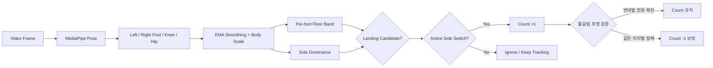
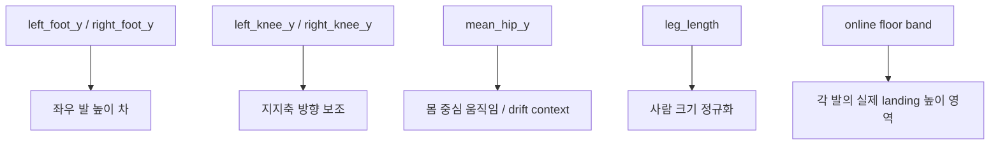
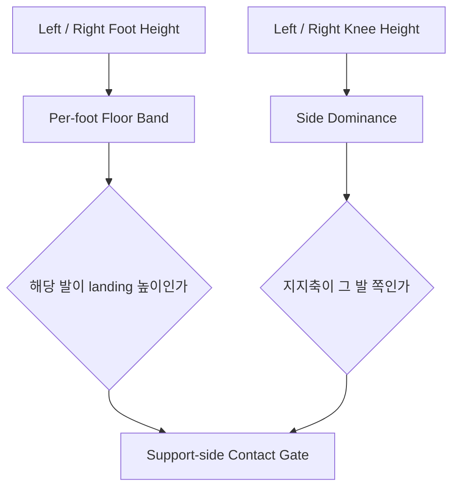
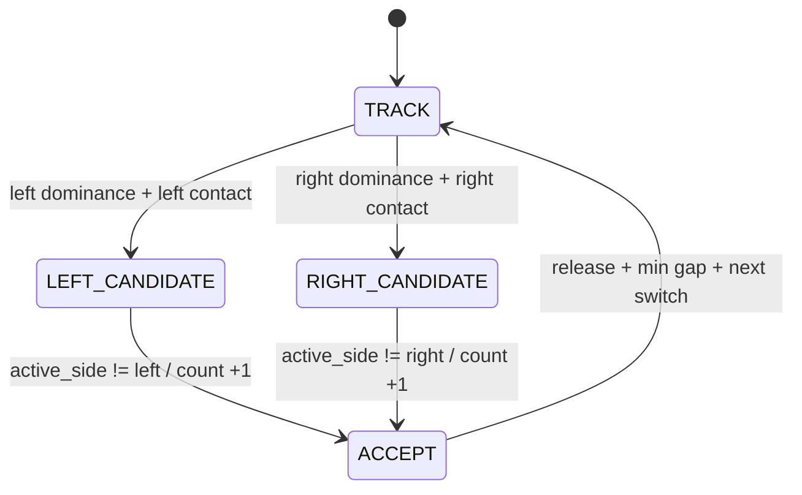
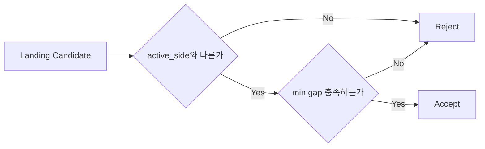
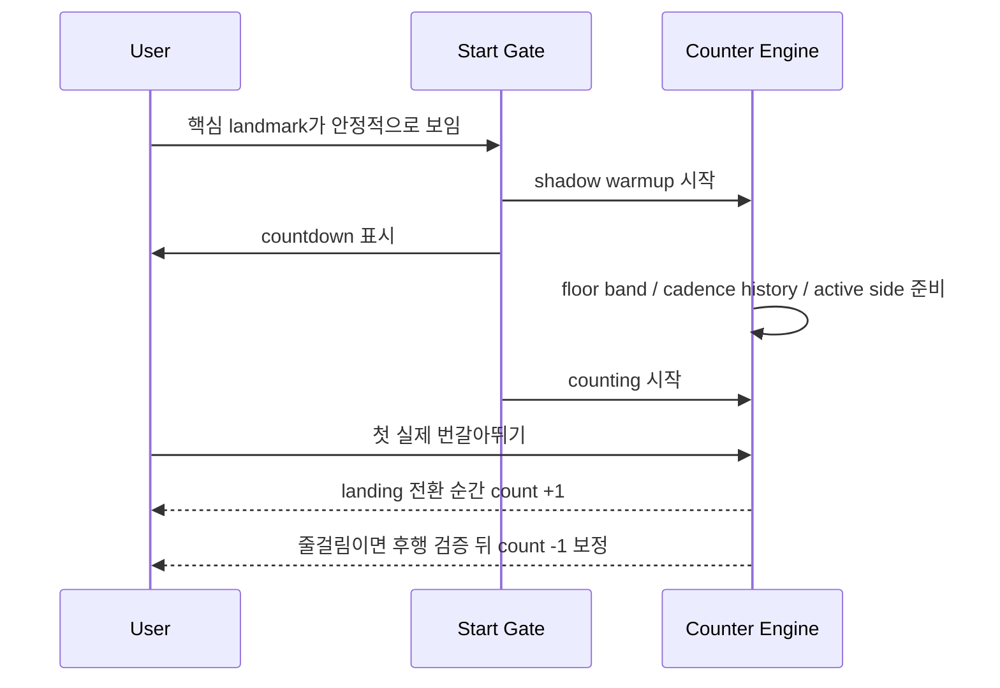

# alternating_jump Counter

이 문서는 `alternating_jump` 카운터가 **무엇을 세는지**, **어떤 신호를 보고 판단하는지**, **왜 보호 로직이 필요한지**를 개념 중심으로 설명한다.  
구체적인 threshold 숫자보다, 엔진이 어떤 순서로 생각하고 왜 그렇게 설계됐는지를 이해하는 데 초점을 둔다.

## 한눈에 보기

이 엔진은 MediaPipe Pose에서 사람의 자세를 읽고,

- 좌우 `foot`과 `knee`로 지금 어느 쪽이 지지발인지 추정하고
- 각 발의 `floor band`로 실제 landing 구간인지 확인한 뒤
- **지지축이 반대편 발로 넘어가는 첫 순간**에 카운트를 올린다.

즉, 공중 apex를 세는 방식이 아니라 **좌우 지지발이 번갈아 landing 하는 순간**을 센다.



## 무엇을 1카운트로 보는가

이 프로젝트에서 1카운트는 아래 순간이다.

> 번갈아뛰기에서 새 지지발이 바닥 근처에 landing 하며, 지지축이 이전 발에서 반대편 발로 넘어가는 첫 순간

중요한 점은 두 가지다.

- 기준 시점은 공중 최고점이 아니다.
- 좌우 발 중 어느 쪽이 지금 실제 지지발인지가 보여야 한다.

그래서 이 엔진은 “얼마나 높이 떴는가”보다 “이번 landing이 이전 카운트와 다른 발의 실제 지지 전환인가”를 더 중요하게 본다.

## 어떤 신호를 보는가

엔진은 많은 landmark를 직접 쓰지 않는다. 실제 카운트 판단에는 몇 가지 핵심 신호만 쓴다.



### `left_foot_y`, `right_foot_y`

ankle, heel, foot index를 묶어 만든 좌우 발 높이다.  
이 신호는 “지금 어느 쪽 발이 더 아래에 있는가”와 “그 발이 실제로 바닥 근처인가”를 판단하는 데 쓴다.

번갈아뛰기에서는 양발이 동시에 같은 의미를 갖지 않는다.

- 한쪽 발은 landing 쪽일 수 있고
- 반대쪽 발은 이미 떠오르는 쪽일 수 있다.

그래서 이 엔진은 평균 foot 하나를 보지 않고, **좌우 발을 분리해서** 본다.

### `left_knee_y`, `right_knee_y`

knee는 발 높이 차만으로 애매할 때 지지축 방향을 보강하는 데 쓴다.  
발 차이만 보면 저해상도 영상이나 저fps 구간에서 좌우 dominance가 흔들릴 수 있기 때문이다.

엔진은 대략적으로 아래 관점을 따른다.

- 발이 더 아래에 있고
- 같은 쪽 무릎도 더 내려와 있으면
- 그쪽이 현재 지지발일 가능성이 높다.

즉, 번갈아뛰기에서 카운트 타이밍은 `foot diff` 하나가 아니라 **foot diff + knee dominance** 조합으로 잡는다.

### `mean_hip_y`

좌우 hip의 평균 높이다.  
이 신호는 모아뛰기처럼 카운트 타이밍의 주신호는 아니고, 몸 중심 움직임과 저주파 드리프트를 보는 보조 신호에 가깝다.

이유는 단순하다.

- 번갈아뛰기에서는 landing 타이밍이 좌우 발 전환으로 더 명확하게 드러난다.
- 하지만 상체가 크게 흔들리거나 카메라 구도가 변하면 전체 y가 함께 움직일 수 있다.

그래서 hip은 “지금이 점프 리듬 안에 있는가”를 보조적으로 해석하는 데 쓴다.

### `leg_length`

hip과 ankle 사이 길이로 만든 몸 크기 기준이다.  
같은 동작도 사람 크기, 카메라 거리, 구도에 따라 다르게 보이므로, 발 차이와 접지 마진은 이 값을 기준으로 정규화한다.

### `online floor band`

이 엔진은 바닥 위치를 고정값으로 두지 않는다.  
대신 각 발이 실제 landing 할 때 형성되는 높이 영역을 온라인으로 계속 추적한다.

중요한 점은 번갈아뛰기에서는 **왼발 바닥 밴드와 오른발 바닥 밴드가 따로 존재한다**는 것이다.

- 왼발 landing은 왼발 floor band 근처에서 확인하고
- 오른발 landing은 오른발 floor band 근처에서 확인한다.

이렇게 해야 한쪽 발이 공중에 있는 상황을 다른 쪽 발의 접지로 잘못 해석하지 않는다.

## 접지를 어떻게 판단하는가

접지는 단순히 “발 y가 크다”로 보지 않는다.  
카메라마다 바닥의 절대 위치가 다르고, 번갈아뛰기에서는 양발의 역할도 매 순간 다르기 때문이다.

대신 엔진은 아래 두 조건을 함께 본다.

- 특정 발이 자기 floor band 근처에 들어왔는가
- 좌우 발과 무릎의 dominance가 그 발 쪽을 가리키는가



기본적으로는 “dominance가 왼쪽이면 왼발이 floor band 근처”, “dominance가 오른쪽이면 오른발이 floor band 근처”일 때만 landing 후보로 본다.

다만 저fps 빠른 리듬에서는 floor band가 순간적으로 늦게 따라오며 진짜 landing을 놓칠 수 있다.  
그래서 cadence가 충분히 안정적인 구간에서는 **near-floor relaxed contact**를 허용해, 발이 바닥 바로 위까지 내려온 강한 dominance pulse도 제한적으로 landing 후보로 받아들인다.

## 카운트는 어떤 순서로 올라가는가

카운트는 “새 지지발 후보가 잡혔다”만으로 바로 올라가지 않는다.  
핵심은 **이전 카운트와 다른 발로 지지축이 전환됐는가**다.



이 흐름을 말로 풀면 이렇다.

1. 먼저 현재 프레임이 왼발 landing인지 오른발 landing인지 본다.
2. 같은 쪽 신호가 짧게라도 유지되면 landing 후보로 잡는다.
3. 그런데 그 발이 이미 직전 active side와 같으면, 같은 landing의 잔흔으로 보고 세지 않는다.
4. 반대편 발로 support side가 넘어간 첫 순간에만 count를 올린다.

여기서 중요한 설계 원칙은 **같은 발의 잔진동보다 좌우 전환을 더 중요하게 보는 것**이다.  
번갈아뛰기에서는 한 landing 내부에 작은 y 진동이 생겨도, 실제 count는 새 지지발로 넘어가는 한 번뿐이어야 한다.

## 왜 보호 로직이 필요한가

번갈아뛰기 카운터는 좌우 발을 분리해서 본다고 해서 자동으로 안정해지지 않는다.  
오히려 발장난, 지연된 floor band, 저fps 샘플링 같은 문제 때문에 보호 로직이 더 중요해진다.

### 1. 발이 흔들렸는데 landing처럼 보이는 문제

발 높이 차만 보면 가벼운 발장난이나 비대칭 흔들림도 “새 지지발”처럼 보일 수 있다.  
그래서 엔진은 foot diff 하나가 아니라 knee dominance와 floor band proximity까지 함께 본다.

즉, “한쪽 발이 조금 아래에 있다”만으로는 부족하고, **그 발이 실제 landing 쪽으로 보이는 자세**가 같이 나와야 한다.

### 2. 같은 landing을 두 번 세는 문제

한 번의 landing 안에서도 foot signal은 여러 프레임 흔들린다.  
그래서 엔진은 `candidate streak`, `active_side`, `side release`, `min gap`을 함께 둔다.



이 보호 장치들의 역할은 조금씩 다르다.

- `candidate streak`: 한 프레임 튐을 즉시 count하지 않게 막는다.
- `active_side`: 같은 발의 잔흔을 다시 세지 않게 막는다.
- `side release`: 충분히 중립으로 돌아온 뒤 다음 전환을 받게 한다.
- `min gap`: accepted count끼리 너무 붙는 경우를 한 번 더 막는다.

### 3. 빠른 리듬에서 undercount가 나는 문제

빠른 cadence에서는 왼발과 오른발 landing 간격이 매우 짧아진다.  
이때 floor band가 느리게 내려오면 실제 landing인데도 접지가 늦게 잡혀 미탐이 날 수 있다.

그래서 이 엔진은 cadence가 빠르고 안정적인 구간에서만 `near-floor relaxed contact`를 허용해, floor band가 약간 늦어도 강한 support-side pulse는 놓치지 않도록 했다.

### 4. 긴 gap에서 중간 landing이 누락되는 문제

저fps 영상이나 landmark 흔들림 때문에 중간 landing이 하나 빠지면, 이후 count 전체가 밀릴 수 있다.  
그래서 엔진은 최근 interval 히스토리를 보고 “지금 gap이 너무 길다”는 것이 분명할 때만 `miss recovery`로 빠진 count를 보정한다.

중요한 점은 이 로직을 항상 켜두지 않는다는 것이다.

- 지나치게 느린 cadence까지 recovery를 허용하면 과보정이 생긴다.
- 그래서 기본 설정은 interval median이 충분히 빠른 구간에서만 recovery를 허용한다.

즉, recovery는 “언제나 count를 채워 넣는 장치”가 아니라, **빠른 리듬에서 누락이 분명할 때만 쓰는 제한적 보정**이다.

### 5. 카메라 구도와 사람 위치가 바뀌는 문제

사람이 카메라 쪽으로 오거나 멀어지면 raw y와 사람 크기 추정이 같이 바뀐다.  
이 변화를 jump motion으로 오해하면 dominance와 접지 마진이 흔들린다.

그래서 엔진은 foot, knee, hip 모두를 smoothing한 뒤, leg length 기준으로 정규화해서 해석한다.  
목표는 “장면 전체 변화”보다 “실제 landing 전환”을 더 안정적으로 읽는 것이다.

### 6. 실시간에서 줄이 걸려 같은 발에 멈췄는데 이미 +1이 올라간 문제

번갈아뛰기는 새 지지발로 넘어가는 첫 순간을 빠르게 잡아야 해서, realtime에서는 반대편 landing이 보이는 즉시 `+1`을 올린다.  
하지만 줄이 걸리면 사용자는 실제로 다음 점프를 이어가지 못했는데도, 순간적인 support-side dominance만 보고 count가 먼저 확정될 수 있다.

그래서 현재 realtime 엔진은 count 직후 짧은 후행 검증 구간을 추가로 둔다.

- 방금 count된 쪽 지지발이 계속 유지되는가
- 반대발 전환이 실제로 이어지지 않는가
- support ratio는 충분했지만 dual-air 회복이 뒤따르지 않는가

이 조합이 성립하면 엔진은 줄걸림으로 보고 방금 count한 값을 `-1` 해서 상쇄한다.

즉 realtime에서는 아래 순서로 동작한다.

1. 새 지지발 landing이 보이면 우선 `+1` 한다.
2. 직후 몇 프레임 동안 반대발 전환이 실제로 이어지는지 본다.
3. 같은 발에 정체되면 줄걸림으로 판단하고 `-1` 보정한다.

오버레이는 엔진이 반환한 `running_count`를 그대로 사용하므로, 이 보정은 화면 숫자에도 즉시 반영된다.

## realtime에서 왜 별도 시작 절차가 필요한가

realtime에서는 카메라에 사람이 들어오는 순간부터 곧바로 count를 올리면 오히려 UX가 나빠질 수 있다.  
아직 landmark가 흔들리거나 floor band가 적응 중이면 첫 몇 개 count가 불안정해지기 때문이다.

그래서 realtime 쪽에는 준비 절차가 있다.



핵심은 두 가지다.

- 시작 전에는 count를 올리지 않는다.
- 대신 그 시간 동안 엔진은 floor band와 내부 상태를 미리 적응시킨다.

또한 counting 이후에는 줄걸림 보정 윈도우가 짧게 열린다.  
그래서 landing 전환은 즉시 보이되, 같은 발에 멈춘 잘못된 count는 다음 몇 프레임 안에 되돌릴 수 있다.

이렇게 해야 첫 landing이 늦거나, 시작 직후 count가 흔들리는 문제를 줄일 수 있다.

## 정리

이 카운터의 핵심은 아래 한 문장으로 요약된다.

> 좌우 `foot`과 `knee`로 현재 지지발을 읽고, 각 발의 `floor band`로 실제 landing을 확인한 뒤, 지지축이 반대편으로 넘어가는 순간을 센다.

그래서 이 엔진은 단순 peak detector가 아니라,

- 좌우 지지발을 분리해서 해석하고
- landing 전환만 count하며
- 빠른 cadence, 저fps, 중복 landing 같은 문제를 별도 로직으로 막는

설명 가능한 온라인 카운터로 구성되어 있다.

## Run

카메라 입력:

```bash
bash scripts/setup_env.sh
source activate
python alternating_jump/run_realtime_counter.py --source 0
```

시연 영상 저장:

```bash
source activate
python alternating_jump/run_realtime_counter.py --source 0 --save-output alternating_jump/artifacts/realtime_demo.mp4
```

데이터셋 검증:

```bash
source activate
MPLCONFIGDIR=/tmp/mpl python alternating_jump/run_dataset_eval.py
```

검증 결과 UI 영상 생성:

```bash
source activate
MPLCONFIGDIR=/tmp/mpl python alternating_jump/run_dataset_eval.py --render-videos
```

생성 결과:

- `alternating_jump/output/dataset_eval_results.json`
- `alternating_jump/output/dataset_eval_report.txt`
- `alternating_jump/output/validation_videos/*.mp4`
