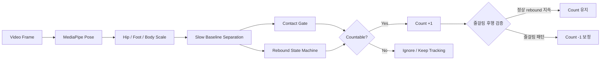
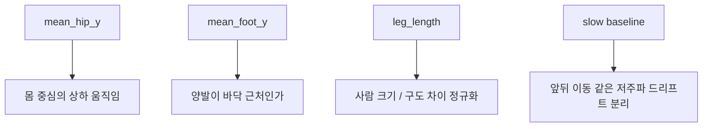
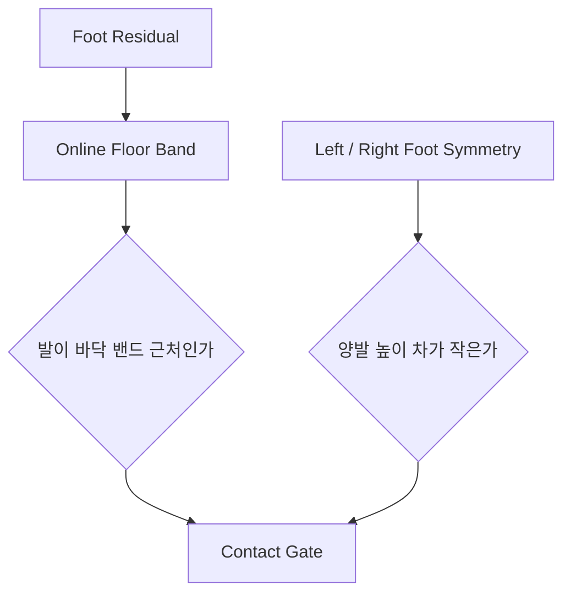
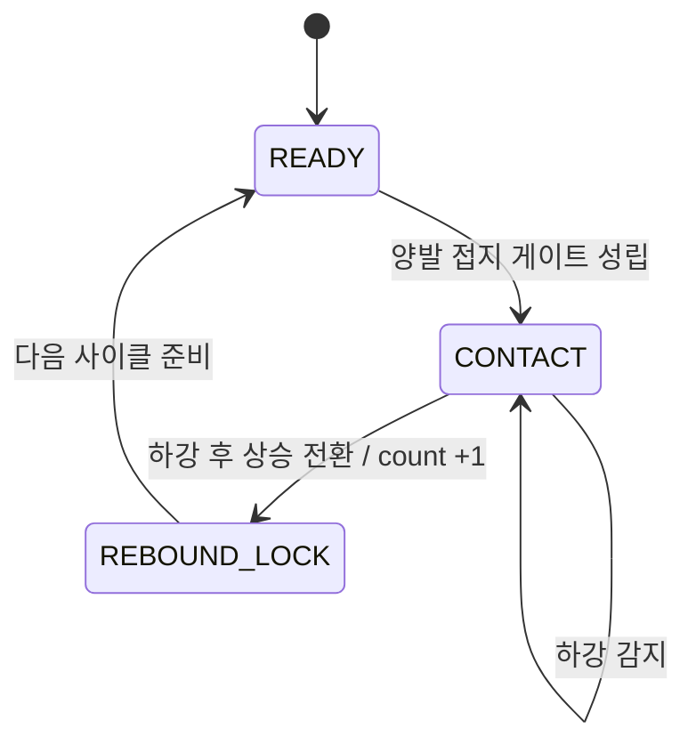
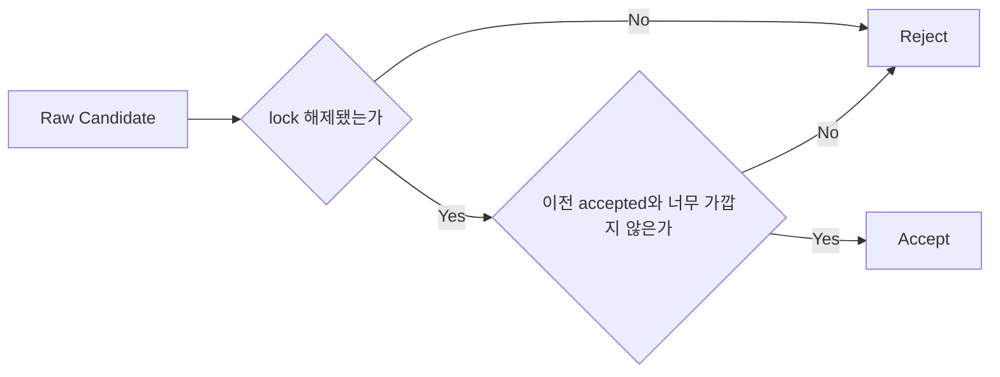
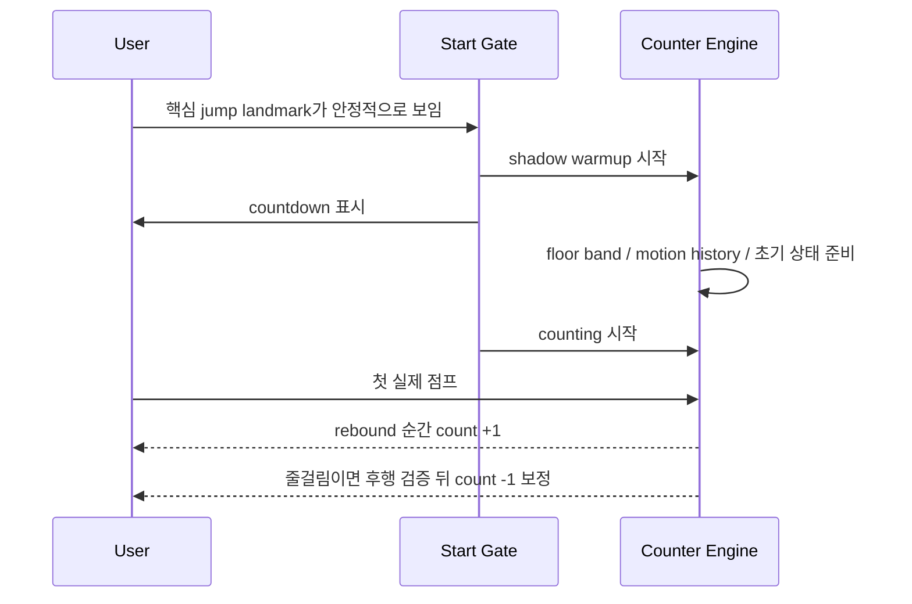

# basic_jump Counter

이 문서는 `basic_jump` 카운터가 **무엇을 세는지**, **어떤 신호를 보고 판단하는지**, **왜 보호 로직이 필요한지**를 개념 중심으로 설명한다.  
구체적인 threshold 숫자보다, 엔진이 어떤 순서로 생각하고 왜 그렇게 설계됐는지를 이해하는 데 초점을 둔다.

## 한눈에 보기

이 엔진은 MediaPipe Pose에서 사람의 자세를 읽고,

- `hip`으로 몸의 상하 반등을 잡고
- `foot`으로 지금이 실제 접지 구간인지 확인한 뒤
- `양발 접지 -> 하강 -> 상승 전환`이 성립하는 순간에 카운트를 올린다.

즉, 공중 apex를 세는 방식이 아니라 **접지된 상태에서 반등이 시작되는 순간**을 센다.



## 무엇을 1카운트로 보는가

이 프로젝트에서 1카운트는 아래 순간이다.

> 양발이 접지된 상태에서 몸이 내려갔다가, 다시 올라가기 시작하는 첫 전환점

중요한 점은 두 가지다.

- 점프의 기준 시점은 공중 최고점이 아니다.
- 발이 바닥 근처에 있는 상태와 몸의 반등 전환이 함께 보여야 한다.

그래서 이 엔진은 “얼마나 높이 떴는가”보다 “지금 반등이 실제 점프의 일부인가”를 더 중요하게 본다.

## 어떤 신호를 보는가

엔진은 많은 landmark를 직접 쓰지 않는다. 실제 카운트 판단에는 몇 가지 핵심 신호만 쓴다.



### `mean_hip_y`

좌우 hip의 평균 높이다.  
카운트 타이밍은 이 신호가 주도한다.

이유는 단순하다.

- 손은 흔들릴 수 있다.
- 발은 가볍게 까딱일 수 있다.
- 하지만 실제 점프에서는 몸 중심의 압축과 반등이 반드시 나타난다.

### `mean_foot_y`

ankle, heel, foot index를 묶어 만든 발 높이다.  
이 신호는 “지금이 실제 접지 구간인가”를 판단하는 데 쓴다.

이 신호를 쓰는 이유는, 힙만 보면 손동작이나 상체 흔들림도 점프처럼 보일 수 있기 때문이다.

### `leg_length`

hip과 ankle 사이 길이로 만든 몸 크기 기준이다.  
같은 움직임도 카메라 구도, 거리, 사람 키에 따라 크기가 다르게 보이므로, 대부분의 판단은 이 값을 기준으로 정규화한다.

### `slow baseline`

이 엔진은 raw y를 그대로 상태기계에 넣지 않는다.  
hip과 foot 각각에 대해 느린 기준선을 잡고, 그 기준선에서 벗어난 **residual motion**을 본다.

이 로직이 필요한 이유는 명확하다.

- 사람이 카메라 쪽으로 오거나 멀어지면 raw y가 같이 변한다.
- 이 변화는 “점프”가 아니라 “장면 안에서의 위치 변화”에 가깝다.
- 엔진은 이런 저주파 드리프트를 baseline 쪽으로 보내고, 실제 반등처럼 빠르게 나타나는 변화만 남기려 한다.

## 접지를 어떻게 판단하는가

접지는 단순히 “발 y가 크다”로 보지 않는다.  
카메라마다 바닥의 절대 위치가 다르기 때문이다.

대신 엔진은 현재 영상 안에서 **발이 실제로 바닥에 닿아 있을 때 형성되는 높이 영역**을 계속 추적한다. 이를 여기서는 `바닥 밴드`라고 부른다.



접지 게이트는 두 조건을 함께 본다.

- 현재 발 residual이 바닥 밴드 근처인가
- 좌우 발 높이 차가 과도하지 않은가

이렇게 해야 하는 이유는 다음과 같다.

- 발이 위아래로 많이 움직여도, 실제 접지가 아닐 수 있다.
- 한쪽 발만 먼저 흔들리는 경우도 있다.
- 두 발이 같이 바닥 근처에 있다는 조건이 있어야 “모아뛰기 접지”에 더 가깝다.

## 카운트는 어떤 순서로 올라가는가

카운트는 상태기계로 관리한다.  
핵심은 “접지 상태에서 내려갔다가 다시 올라가는 첫 전환만 세기”다.



이 흐름을 말로 풀면 이렇다.

1. 먼저 양발이 접지 상태인지 확인한다.
2. 접지 상태에서 hip residual이 아래로 내려가면 “반등 준비”로 본다.
3. 그 다음 hip residual이 다시 올라가기 시작하는 첫 프레임에서 count를 올린다.
4. count 직후에는 같은 점프를 다시 세지 않도록 잠깐 lock 상태로 들어간다.

여기서 중요한 설계 원칙은 **늦게 세지 않는 것**이다.  
엔진은 미래 프레임 전체를 본 뒤 peak를 고르는 방식이 아니라, 현재 프레임까지의 정보만으로 전환을 판단한다.

즉, 사용자가 점프한 뒤 화면을 보면 **반등이 보이는 즉시 숫자가 올라오도록** 설계되어 있다.

## 왜 보호 로직이 필요한가

점프 카운터는 단순 상태기계만으로는 쉽게 흔들린다.  
이 엔진이 보호 로직을 여러 겹 두는 이유는, 대부분의 오탐과 미탐이 몇 가지 반복 패턴으로 나타나기 때문이다.

### 1. 손만 움직였는데 점프로 보이는 문제

hip만 보면 상체 흔들림이나 팔 동작도 반등처럼 보일 수 있다.  
그래서 contact gate가 없으면 손동작에 count가 쉽게 올라간다.

### 2. 발만 움직였는데 점프로 보이는 문제

발 signal만 보면 발장난, 제자리 발걸음, 한쪽 발 흔들림도 접지 이벤트처럼 보일 수 있다.  
그래서 hip motion이 충분하지 않으면 reject한다.

### 3. 같은 점프를 두 번 세는 문제

한 번의 점프 안에서도 foot signal과 hip velocity는 여러 번 흔들릴 수 있다.  
그래서 상태기계 내부에는 `lock`, 최종 accept 단계에는 `min gap`을 둔다.



`lock`과 `min gap`은 비슷해 보이지만 역할이 다르다.

- `lock`: 상태기계 내부에서 같은 점프의 잔흔을 다시 세지 않게 막는다.
- `min gap`: 최종 accepted count끼리 너무 붙어 있는 경우를 한 번 더 차단한다.

### 3-1. 실시간에서 줄이 걸렸는데 이미 +1이 올라간 문제

기본 카운트 시점은 `양발 접지 -> 하강 -> 상승 전환`이 보이는 첫 순간이다.  
이 시점은 realtime 반응성을 위해 충분히 이른 편이어서, 줄이 발에 걸린 경우에도 일단 정상 rebound처럼 보이면 `+1`이 먼저 찍힐 수 있다.

그래서 현재 realtime 엔진은 count 직후 짧은 후행 검증 구간을 추가로 본다.

- count 직후 몇 프레임 동안 접지 상태가 계속 유지되는가
- 실제 이탈 높이(`release height`)가 충분히 회복되지 않는가
- 몸은 점프를 시도한 흔적이 있는데 공중 구간으로 이어지지 않는가

이 조합이 성립하면 엔진은 해당 count를 줄걸림으로 보고 `-1` 보정 이벤트를 내보낸다.

즉 realtime에서는 아래 순서로 동작한다.

1. 반응성을 위해 rebound 전환 순간에 우선 `+1` 한다.
2. 직후 몇 프레임을 다시 본다.
3. 줄걸림 패턴이면 방금 올린 카운트를 `-1` 해서 상쇄한다.

중요한 점은 이 보정이 **화면 숫자에도 즉시 반영된다**는 것이다.  
오버레이는 엔진이 반환한 `running_count`를 그대로 쓰므로, 보정 이벤트가 발생하면 표시 숫자도 함께 내려간다.

### 4. 빠른 리듬에서 undercount가 나는 문제

`min gap`을 너무 크게 잡으면 빠른 cadence에서 진짜 점프까지 잘라낸다.  
그래서 이 엔진은 최근 jump 간격을 보고 빠른 리듬으로 판단되면 gap을 자동으로 줄인다.

### 5. 앞뒤 이동 때문에 카운트가 흔들리는 문제

사람이 카메라 쪽으로 오거나 멀어지면 hip, foot, leg scale이 같이 변한다.  
이걸 jump motion으로 오해하면 count가 흔들린다.

그래서 이 엔진은 raw y를 바로 쓰지 않고, 느린 baseline을 분리한 residual motion 위에서 상태기계를 돌린다.  
목표는 “사람 전체가 장면 안에서 움직이는 변화”와 “실제 반등”을 서로 다른 층에서 다루는 것이다.

## realtime에서 왜 별도 시작 절차가 필요한가

realtime에서는 카메라에 사람이 들어오는 순간부터 곧바로 count를 올리면 오히려 UX가 나빠질 수 있다.  
아직 자세가 안 잡혔거나 landmark가 흔들리는 동안 count가 시작되면 첫 몇 개가 불안정해지기 때문이다.

그래서 realtime 쪽에는 준비 절차가 있다.



핵심은 두 가지다.

- 시작 전에는 count를 올리지 않는다.
- 대신 그 시간 동안 엔진은 가만히 있지 않고, 바닥 밴드와 motion history를 미리 적응시킨다.

또한 counting 이후에는 줄걸림 보정 윈도우가 짧게 열린다.  
덕분에 정상 점프는 즉시 보이고, 줄이 걸린 경우에는 이미 올라간 숫자를 다음 몇 프레임 안에 되돌릴 수 있다.

이렇게 해야 첫 점프가 늦거나, 시작 직후 몇 개가 비는 문제를 줄일 수 있다.

또한 start gate는 “전신 33개 landmark 모두 완비”보다, 실제 점프 판단에 필요한 핵심 landmark가 안정적으로 보이는지를 더 중요하게 본다.  
이렇게 해야 진입이 과도하게 늦어지지 않는다.

## 정리

이 카운터의 핵심은 아래 한 문장으로 요약된다.

> `hip`으로 반등 시점을 잡고, `foot`으로 실제 접지 여부를 확인하며, realtime 환경에서는 drift와 중복을 따로 방어한다.

그래서 이 엔진은 단순 peak detector가 아니라,

- 접지 여부를 먼저 확인하고
- 그 안에서 반등 전환을 세고
- realtime에서 흔히 생기는 오탐과 미탐 패턴을 별도 로직으로 막는

설명 가능한 온라인 카운터로 구성되어 있다.

## Run

카메라 입력:

```bash
bash scripts/setup_env.sh
source activate
python basic_jump/run_realtime_counter.py --source 0
```

시연 영상 저장:

```bash
source activate
python basic_jump/run_realtime_counter.py --source 0 --save-output basic_jump/artifacts/realtime_demo.mp4
```

데이터셋 검증:

```bash
source activate
MPLCONFIGDIR=/tmp/mpl python basic_jump/run_dataset_eval.py
```

검증 결과 UI 영상 생성:

```bash
source activate
MPLCONFIGDIR=/tmp/mpl python basic_jump/run_dataset_eval.py --render-videos
```

생성 결과:

- `basic_jump/output/dataset_eval_results.json`
- `basic_jump/output/dataset_eval_report.txt`
- `basic_jump/output/validation_videos/*.mp4`
