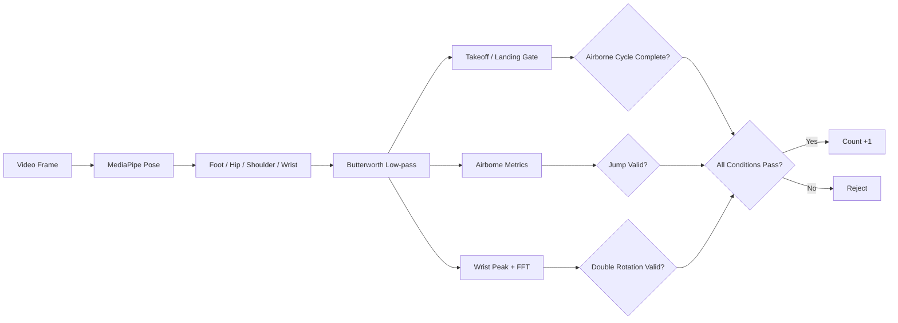
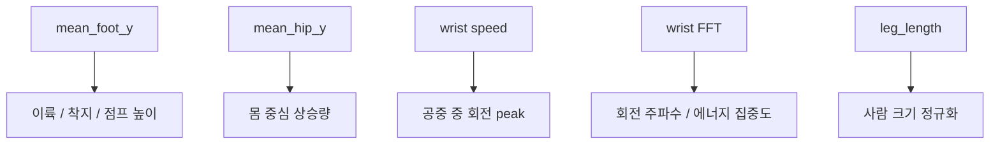
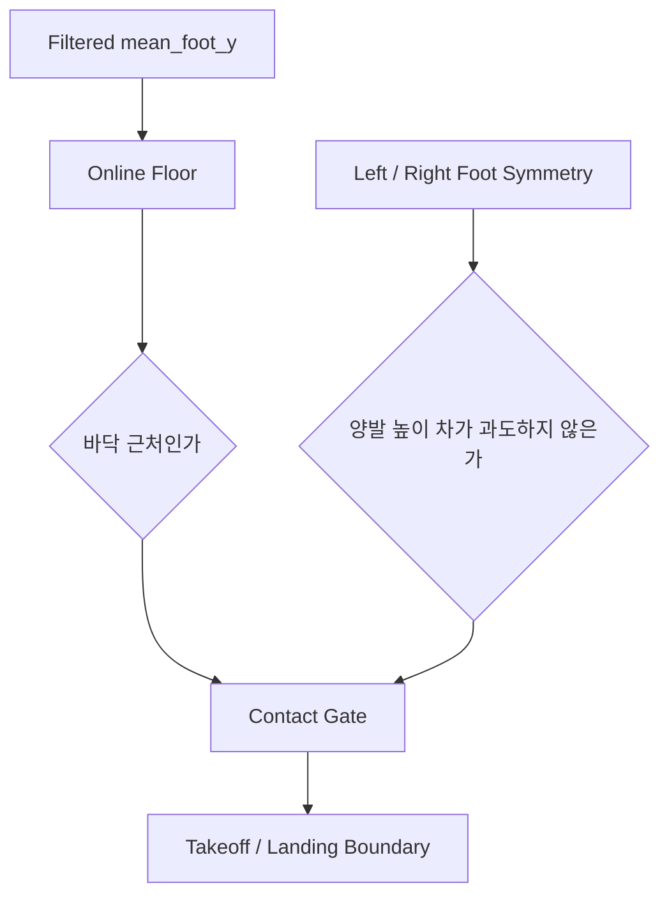
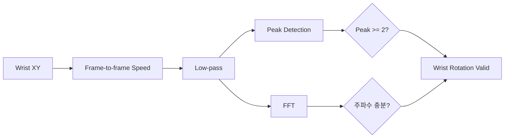
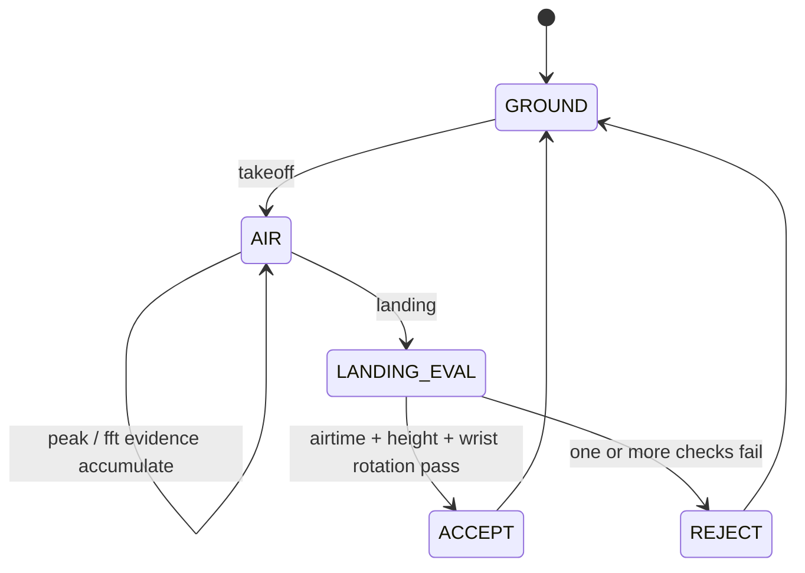

# double_jump Counter

이 문서는 `double_jump` 카운터가 **무엇을 1카운트로 보는지**, **어떤 신호를 조합해 판단하는지**, **왜 손목 회전과 체공 시간을 같이 보는지**를 설명한다.  
현재 구현은 `basic_jump`의 접지-반등 카운터가 아니라, **이단 뛰기 전용 공중 체류 + 손목 회전 검출기**다.

## 한눈에 보기

이 엔진은 MediaPipe Pose에서 사람의 자세를 읽고,

- `foot`으로 이륙과 착지를 구분하고
- `hip`으로 점프 높이와 체공의 질을 확인하고
- `wrist`로 공중 중 줄 2회전에 해당하는 빠른 회전 리듬을 검증한 뒤
- **한 번의 점프 안에서 손목 회전이 충분히 두 번 발생한 경우만** 1카운트한다.

즉, 단순히 "높이 떴다"를 세는 것이 아니라, **공중 구간 안에서 double-under 특유의 빠른 손목 회전이 동반된 점프만** 세도록 설계되어 있다.



## 무엇을 1카운트로 보는가

이 프로젝트에서 1카운트는 아래 순간이다.

> 이륙 후 공중에 머무는 동안 손목 회전이 두 번 이상 충분히 나타나고, 그 점프가 다시 착지로 닫히는 한 사이클

중요한 점은 세 가지다.

- 카운트 기준은 단순 착지도 아니고, 단순 최고점도 아니다.
- 공중 구간이 충분히 길어야 한다.
- 공중 중 손목 회전이 점프 리듬보다 빠르게 두 번 나타나야 한다.

그래서 이 엔진은 "높이만 높다"거나 "손목만 빨리 돈다"는 이유만으로는 count를 올리지 않는다.  
**점프와 손목 회전이 이단 뛰기 패턴으로 결합되어야만** count한다.

## 이단 뛰기 특성을 어떻게 반영했는가

이 구현은 아래 세 가지 특성을 직접 반영한다.

### 1. 공중에서 줄 2회전을 통과하면 1카운트

핵심은 접지 순간이 아니라 **한 번의 airborne cycle**이다.

- 이륙이 시작되면 air phase에 들어간다.
- 그동안 손목 속도 peak를 모은다.
- 다시 착지했을 때 air phase 전체를 평가한다.
- 공중 구간 안에서 손목 회전이 충분히 두 번 있었으면 1카운트한다.

즉, "점프 한 번당 2카운트"가 아니라 **double-under 한 번당 1카운트**다.

### 2. 점프를 높게 하는 것보다 손목을 빠르게 돌리는 것이 중요

이 구현은 손목 회전을 단순 보조 신호로 두지 않는다.  
실제로 최종 accept 조건에서 손목 회전 검증이 없으면 count가 올라가지 않는다.

손목 회전은 두 층으로 본다.

- 시간영역: 공중 중 wrist speed peak 개수와 peak 크기
- 주파수영역: FFT로 본 dominant wrist frequency와 power concentration

즉, 높이는 최소한만 확보하면 되고, **손목 회전 리듬이 충분히 빠르고 선명한가**가 더 중요한 조건이다.

### 3. 모아뛰기보다 긴 체공시간과 점프높이를 가진다

이 엔진은 기본 jump보다 더 긴 체공을 전제로 한다.

- `min_airborne_frames`
- `max_airborne_frames`
- `min_jump_height_ratio`
- `min_long_airborne_height_ratio`
- `long_airborne_frames`

같은 이유로 hip lift도 별도 조건으로 본다.  
발이 잠깐 떠 보이는 정도가 아니라, **몸 중심까지 실제로 충분히 떠 있는가**를 함께 확인한다.

## 어떤 신호를 보는가

실제 판단에 쓰는 핵심 신호는 네 묶음이다.



### `mean_foot_y`

좌우 발 높이 평균이다.  
이 신호는 바닥 근처인지 아닌지를 판단하는 데 쓴다.

용도는 세 가지다.

- 현재가 접지 상태인지
- 이륙이 시작됐는지
- 공중에서 얼마나 떠 있는지

즉, foot은 이 엔진에서 **air phase의 문을 여닫는 역할**을 한다.

### `mean_hip_y`

좌우 hip 평균 높이다.  
이 신호는 jump quality를 보조하는 데 쓴다.

이유는 명확하다.

- 발만 보면 발끝 움직임이나 landmark 튐에도 반응할 수 있다.
- 하지만 실제 이단 뛰기에서는 몸 중심도 함께 올라간다.

그래서 이 엔진은 foot height만으로는 accept하지 않고, **hip lift가 충분한지**를 같이 본다.

### `wrist speed`

손목 속도는 이단 뛰기의 핵심 신호다.

구현에서는 손목 좌표 변화량에서 어깨 중심 이동을 일부 빼서,
몸 전체가 흔들리는 움직임보다 **실제 손목 회전 성분**을 더 강하게 보도록 했다.

공중 중에는 이 wrist speed에서 peak를 찾는다.

- peak 수가 충분한가
- peak가 충분히 큰가
- peak가 너무 붙어 있는 가짜 분할은 아닌가

이 조건을 만족해야 줄 2회전에 가까운 패턴으로 본다.

### `wrist FFT`

시간영역 peak만으로는 잡음에 흔들릴 수 있어서 주파수영역 검증도 같이 쓴다.

FFT로 보는 것은 아래 세 가지다.

- dominant wrist frequency
- 그 주파수에 power가 얼마나 집중되는가
- wrist frequency가 jump frequency보다 충분히 빠른가

이단 뛰기에서는 손목 회전이 점프 리듬보다 빨라야 하므로,  
엔진은 **wrist-to-jump frequency ratio**를 별도 accept 조건으로 둔다.

### `leg_length`

사람 크기와 카메라 거리 차이를 줄이기 위한 정규화 기준이다.

- jump height
- hip lift
- wrist speed
- contact margin

모두 이 값을 기준으로 정규화해서, 사람마다 절대 좌표가 다른 문제를 줄인다.

## 왜 Butterworth low-pass를 쓰는가

원시 landmark 좌표는 프레임마다 흔들린다.  
이 흔들림을 그대로 쓰면 손목 peak가 과하게 늘어나거나, 발 접지가 불안정하게 보일 수 있다.

그래서 구현은 2차 Butterworth low-pass 필터를 넣었다.

- foot: 접지와 높이 추정을 안정화
- hip: 체공과 몸 중심 상승량 추정 안정화
- wrist speed: 회전 리듬은 남기고 landmark jitter는 완화

중요한 점은, 완전히 느린 baseline만 보는 것이 아니라  
**이단 뛰기의 빠른 wrist cadence는 살리고, 관측 노이즈만 깎는 방향**으로 cutoff를 따로 둔다는 것이다.

## 접지와 체공은 어떻게 판단하는가

접지는 절대 바닥 y를 고정값으로 두지 않는다.  
대신 현재 영상에서 발이 실제로 닿아 있는 높이 영역을 online floor처럼 갱신한다.



이후 air phase는 다음처럼 정의한다.

1. contact gate를 벗어나고 발 높이가 일정 수준 이상 올라가면 이륙으로 본다.
2. 그 뒤 다시 contact gate 안으로 들어오면 착지로 본다.
3. 이륙부터 착지까지의 전체 구간을 한 번의 jump cycle로 평가한다.

즉, 이 엔진은 한 프레임 순간을 세는 것이 아니라 **airborne segment 전체를 평가**한다.

## 손목 회전은 어떻게 판단하는가

손목 회전은 peak 기반과 FFT 기반을 같이 쓴다.



### peak 검증

공중 구간 안에서 wrist speed가 local maximum를 만들면 peak 후보로 본다.

단, 아래는 제외한다.

- 충분히 빠르지 않은 peak
- 직전 peak와 너무 가까운 peak
- 프레임 노이즈가 만든 가짜 peak

이렇게 해서 공중 중 **실제 회전 pulse가 두 번 이상 있었는지**를 본다.

### FFT 검증

FFT는 peak 검출의 보완 역할이다.

- peak 수가 경계선일 때
- low-fps 영상이라 시간영역 peak가 뭉개질 때
- landmark가 조금 흔들려도 주기성 자체는 남아 있을 때

이때 dominant wrist frequency와 jump frequency를 비교하면,  
"손목이 점프보다 충분히 빠른 cadence로 돌고 있는가"를 더 안정적으로 볼 수 있다.

## 카운트는 어떤 순서로 올라가는가



말로 풀면 다음과 같다.

1. 지면 상태에서 발이 바닥에서 충분히 떨어지면 air phase를 연다.
2. 공중 구간 동안 점프 높이, hip lift, wrist peak를 계속 누적한다.
3. 착지 시점이 오면 FFT까지 포함해 공중 구간 전체를 평가한다.
4. 체공 시간, 점프 높이, hip lift, 손목 회전 조건이 모두 맞으면 1카운트한다.

즉, **공중 중 2회전 + 착지로 닫히는 한 사이클**이 이단 뛰기 1회다.

## 왜 보호 로직이 필요한가

이단 뛰기 카운터는 손목과 점프를 같이 보기 때문에, 보호 로직이 없으면 오히려 더 불안정해질 수 있다.

### 1. 손만 빨리 돌렸는데 점프로 보이는 문제

손목 속도만 보면 줄 없이 손만 돌려도 count가 올라갈 수 있다.  
그래서 체공 시간과 jump height, hip lift가 함께 충족돼야 한다.

### 2. 높게 뛰었는데 이단 뛰기가 아닌 문제

일반 모아뛰기에서도 체공 시간이 길 수 있다.  
그래서 wrist peak 또는 wrist FFT 조건이 없으면 accept하지 않는다.

### 3. 손목 노이즈가 회전 2번처럼 보이는 문제

pose landmark는 특히 손목에서 흔들릴 수 있다.  
그래서 low-pass, peak refractory, FFT power concentration을 함께 둔다.

### 4. 빠른 연속 점프에서 중복 카운트가 나는 문제

착지 직후의 잔흔이나 짧은 재도약 때문에 같은 jump cycle이 두 번 세질 수 있다.  
그래서 `min gap`을 두고, 최근 accepted interval을 바탕으로 adaptive gap도 적용한다.

### 5. 체공이 너무 길거나 landmark가 끊긴 문제

검출이 끊기거나 air phase가 비정상적으로 길어지면 그 구간을 폐기한다.  
이렇게 해야 잘못 열린 airborne state가 다음 점프까지 오염시키지 않는다.

## realtime에서 왜 별도 시작 절차가 필요한가

realtime에서는 사람이 화면에 막 들어온 순간부터 세면 손목과 발 landmark가 아직 안정적이지 않을 수 있다.

그래서 start gate는 아래를 보장한다.

- 어깨 / 팔 / 손목 / 하체 landmark가 일정 비율 이상 보일 것
- 준비 상태가 일정 시간 유지될 것
- 그동안 floor와 필터 상태가 먼저 적응될 것

이렇게 해야 첫 점프부터 hand cadence와 airborne cycle이 안정적으로 측정된다.

## 구현 요약

현재 `double_jump` 엔진의 핵심은 아래 한 문장으로 요약된다.

> `foot`으로 airborne cycle을 자르고, `hip`으로 점프 질을 확인하고, `wrist`의 peak와 FFT로 공중 중 2회전을 검증한 뒤 landing 시점에 1카운트한다.

즉, 이 엔진은 단순 peak detector가 아니라,

- 공중 구간을 먼저 정의하고
- 그 안에서 점프와 손목 회전을 따로 누적하고
- 착지 시점에 전체 구간을 평가하는

설명 가능한 online double-under counter다.

## Run

카메라 입력:

```bash
bash scripts/setup_env.sh
source activate
python double_jump/run_realtime_counter.py --source 0
```

시연 영상 저장:

```bash
source activate
python double_jump/run_realtime_counter.py --source 0 --save-output double_jump/artifacts/realtime_demo.mp4
```

실시간 임계값 조정 예시:

```bash
source activate
python double_jump/run_realtime_counter.py \
  --source 0 \
  --min-airborne-frames 7 \
  --min-jump-height-ratio 0.12 \
  --min-wrist-peak-speed-ratio 0.90 \
  --min-fft-power-ratio 0.36 \
  --debug-filter
```

데이터셋 검증:

```bash
source activate
MPLCONFIGDIR=/tmp/mpl python double_jump/run_dataset_eval.py
```

검증 결과 UI 영상 생성:

```bash
source activate
MPLCONFIGDIR=/tmp/mpl python double_jump/run_dataset_eval.py --render-videos
```

생성 결과:

- `double_jump/output/dataset_eval_results.json`
- `double_jump/output/dataset_eval_report.txt`
- `double_jump/output/validation_videos/*.mp4`
