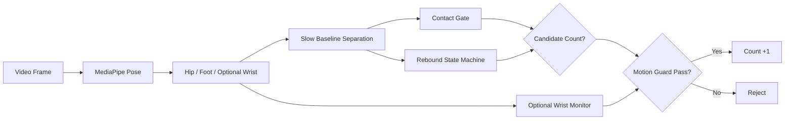
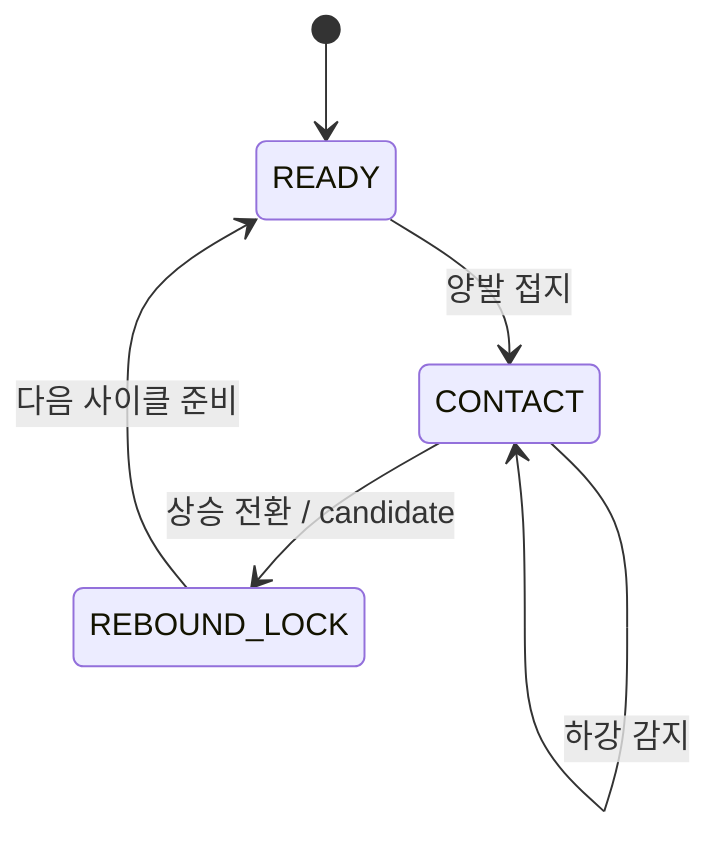

# double_jump Counter

이 문서는 `double_jump` 카운터를 `basic_jump` 구조를 기준으로 다시 설계한 현재 알고리즘을 설명한다.  
핵심 목표는 간단하다.

- 2단뛰기를 `손목 2회전 증명`이 아니라 `안정적인 1회 점프 사이클`로 센다.
- 카운트 주신호는 `hip + foot`로 두고,
- `wrist`는 realtime 모니터링과 약한 보조 신호로만 남긴다.

즉, 예전처럼 손목 회전 조건이 조금만 흔들려도 전체 count를 버리는 구조가 아니다.

## 한눈에 보기

## 무엇을 1카운트로 보는가

이 프로젝트에서 1카운트는 아래 순간이다.

> 양발이 바닥 근처에 모여 있는 상태에서 몸이 눌렸다가 다시 올라가기 시작하는 한 번의 반등 전환

중요한 점은 두 가지다.

- 카운트 기준은 `공중 최고점`이 아니다.
- `손목 회전량`은 필수 통과 조건이 아니다.

그래서 실제 2단뛰기인데 손목 landmark가 흔들리거나 일부 프레임에서 빠져도, 하체 반등이 충분하면 카운트가 유지된다.

## 왜 기존 방식이 엄격했는가

이전 구현은 airborne 구간 동안 손목 회전량, peak, 주기, FFT 근거를 강하게 요구했다.  
이 방식은 이론적으로는 double-under를 직접 설명하기 쉽지만, 실제 영상에서는 다음 문제가 컸다.

- 손목 landmark가 튀면 전체 cycle이 reject된다.
- 일반인처럼 낮게 뛰는 샘플에서 손목 회전 추정이 쉽게 무너진다.
- `AverageTimeStampsPerFrame`가 `512`가 아닌 `.kva` 파일은 라벨 프레임 변환도 틀어질 수 있다.

이번 재설계에서는 이 세 가지를 모두 줄였다.

## 현재 알고리즘의 핵심

### 1. `foot`으로 접지 상태를 본다

ankle, heel, foot index를 묶어 양발 높이를 만들고,  
온라인으로 바닥 높이 band를 추적한다.

- 발이 바닥 band 근처에 있고
- 좌우 발 높이 차가 너무 크지 않으면
- 현재 프레임을 접지 구간으로 본다.

### 2. `hip`으로 반등 타이밍을 잡는다

좌우 hip 평균 높이에서 느린 baseline을 분리한 뒤 residual motion을 본다.

- 접지 상태에서 몸이 아래로 눌리면 `descent`
- 그 뒤 다시 위로 반등하면 `ascent`
- `접지 -> descent -> ascent 전환`이 성립하는 첫 프레임을 count candidate로 만든다.

이 부분은 `basic_jump`와 같은 온라인 반등 상태기계다.

### 3. 최종 accept는 하체 motion guard가 맡는다

candidate가 나와도 아무 반등이나 다 세지는 않는다.  
최근 window에서 아래 값을 다시 확인한다.

- hip range가 너무 작지 않은가
- foot range가 너무 작지 않은가
- 최근 hip range가 남아 있는가
- foot motion만 과하게 큰 `발장난 패턴`은 아닌가
- 이전 accepted count와 너무 가깝지 않은가

즉, 손목보다 `실제 점프처럼 보이는 하체 패턴`을 더 중요하게 본다.

### 4. `wrist`는 optional monitor다

손목 landmark가 잡히면 아래 값을 계속 계산한다.

- wrist speed
- peak interval
- cadence
- rotation balance

하지만 이 값들은 기본적으로 UI 모니터링과 디버깅용이다.  
팔 정보가 일부 프레임에서 없어도 카운터 전체를 중단하지 않는다.

## 왜 이 설계가 2단뛰기에 더 잘 맞는가

2단뛰기도 결국 사용자가 체감하는 1회는 `한 번의 점프 사이클`이다.  
실제 카운트 실패의 대부분은 손목 회전 수를 못 읽어서 생기지, 하체 반등 자체가 없어서 생기지 않는다.

그래서 이번 설계는 다음 원칙을 따른다.

- `count definition`은 점프 사이클에 둔다.
- `style evidence`는 손목에서 보조적으로 본다.
- landmark dropout이 있어도 하체 카운트는 계속 간다.

이 방향이 실영상 데이터셋에서는 훨씬 안정적이었다.

## 라벨 처리도 같이 수정됨

`.kva`의 `AverageTimeStampsPerFrame`는 파일마다 다를 수 있다.

- 어떤 파일은 `512`
- 어떤 파일은 `1001`

기존처럼 무조건 `512`로 나누면 라벨 프레임이 영상 길이보다 길어져 평가가 틀어진다.  
현재 구현은 `AverageTimeStampsPerFrame` 값을 읽어서 timestamp를 frame index로 변환한다.

즉, dataset eval도 이제 영상 길이와 라벨 길이가 제대로 맞는다.

## 정리

현재 `double_jump` 카운터는 아래 한 문장으로 요약된다.

> `foot`으로 접지를 확인하고, `hip`으로 반등 전환을 세며, `wrist`는 보조 모니터로만 사용한다.

그래서 이 엔진은

- 손목 조건 때문에 과도하게 놓치지 않고
- `basic_jump`와 같은 설명 가능한 상태기계를 유지하면서
- double jump 데이터셋에서도 안정적으로 count할 수 있는

보다 실전적인 온라인 카운터다.
