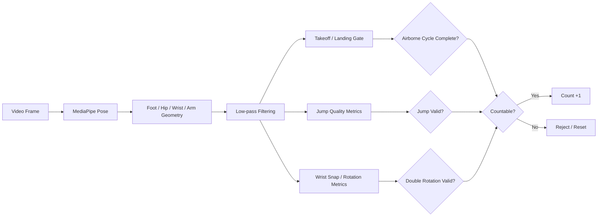
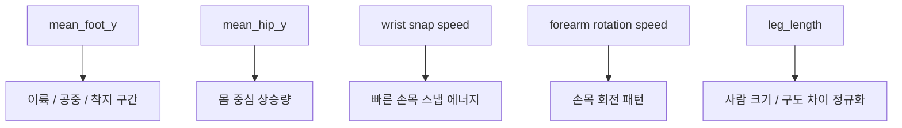
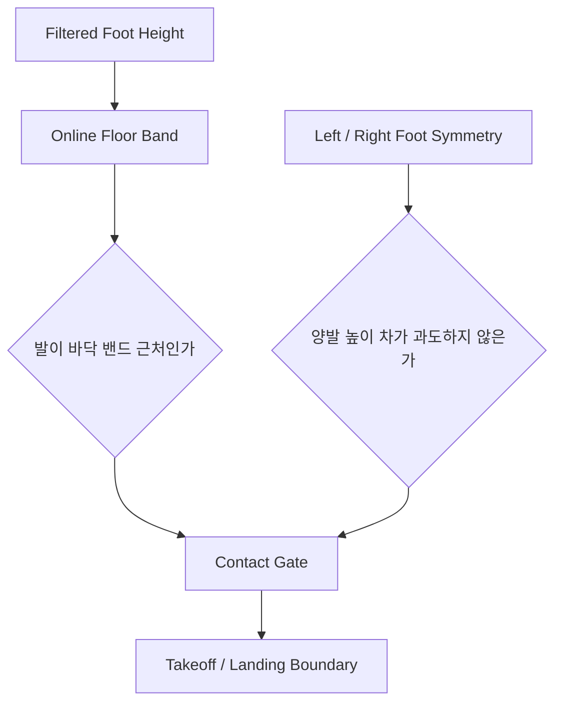
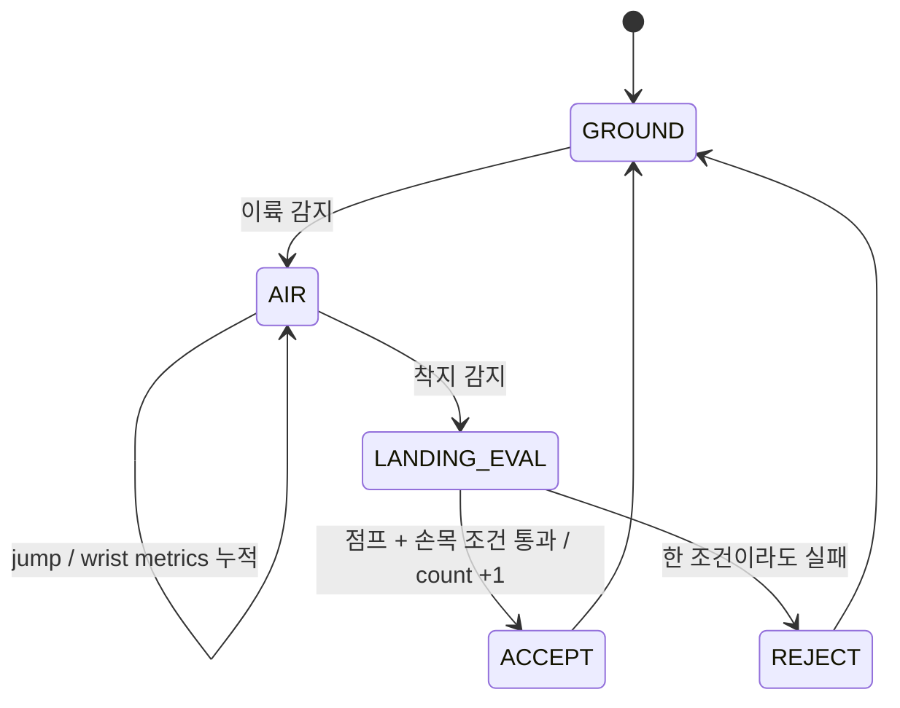
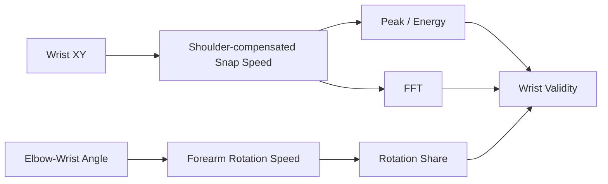
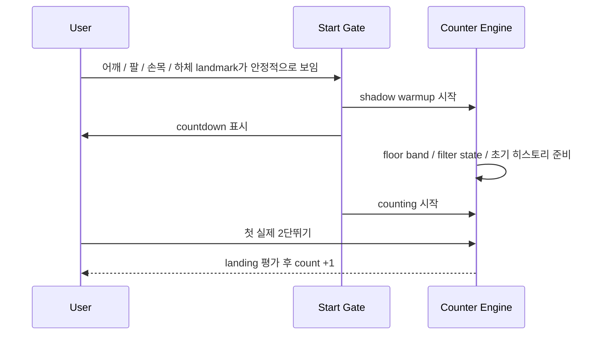

# double_jump Counter

이 문서는 `double_jump` 카운터가 **무엇을 세는지**, **어떤 신호를 보고 판단하는지**, **왜 손목 스냅 보호 로직이 필요한지**를 개념 중심으로 설명한다.  
구체적인 threshold 숫자보다, 엔진이 어떤 순서로 생각하고 왜 그렇게 설계됐는지를 이해하는 데 초점을 둔다.

## 한눈에 보기

이 엔진은 MediaPipe Pose에서 사람의 자세를 읽고,

- `foot`으로 지금이 이륙 전인지, 공중인지, 착지인지 구분하고
- `hip`으로 실제 점프가 맞는지 최소 체공 품질을 확인하고
- `wrist`로 공중 구간 안에 빠른 손목 스냅과 회전 패턴이 충분히 있었는지를 검증한 뒤
- **점프 1회 안에서 줄 2회전에 가까운 손목 패턴이 성립한 경우만** 카운트를 올린다.

즉, 단순히 “높이 떴다”를 세는 것이 아니라 **한 번의 점프 안에서 손목이 충분히 빠르게 두 번 돌아간 jump cycle**만 세도록 설계되어 있다.



## 무엇을 1카운트로 보는가

이 프로젝트에서 1카운트는 아래 순간이다.

> 한 번의 점프가 이륙부터 착지까지 닫히고, 그 공중 구간 안에서 손목 스냅/회전이 2단뛰기 패턴으로 충분히 나타난 한 사이클

중요한 점은 세 가지다.

- 기준 시점은 공중 최고점이 아니다.
- 단순 착지 순간만 보는 것도 아니다.
- 손목이 빠르게 돌았다는 사실과 실제 점프 구간이 함께 보여야 한다.

그래서 이 엔진은 “얼마나 높이 떴는가”보다 “그 점프 안에 실제 2회전성 손목 패턴이 들어 있었는가”를 더 중요하게 본다.

## 어떤 신호를 보는가

엔진은 많은 landmark를 직접 쓰지 않는다. 실제 카운트 판단에는 몇 가지 핵심 신호만 쓴다.



### `mean_foot_y`

ankle, heel, foot index를 묶어 만든 양발 평균 높이다.  
이 신호는 “지금이 바닥 근처인가, 아니면 공중 구간인가”를 판단하는 데 쓴다.

이 신호를 쓰는 이유는, 2단뛰기는 손목이 핵심이지만 그래도 **점프 1회당 1카운트**라는 구조는 유지되어야 하기 때문이다.

### `mean_hip_y`

좌우 hip의 평균 높이다.  
이 신호는 점프가 실제로 일어났는지, 발끝만 들썩인 것이 아닌지를 확인하는 데 쓴다.

이유는 단순하다.

- 발만 보면 발끝 까딱임이나 landmark 튐도 점프처럼 보일 수 있다.
- 하지만 실제 2단뛰기에서는 몸 중심도 함께 올라간다.

그래서 이 엔진은 손목이 빨라도 hip lift가 너무 약하면 reject한다.

### `wrist snap speed`

손목 좌표의 프레임 간 변화량에서 어깨 중심 이동을 일부 빼서 만든 신호다.  
즉, 상체 전체가 흔들리는 움직임보다 **실제 손목 스냅의 빠른 속도 변화**를 더 강하게 보도록 만든다.

이 신호는 아래를 보는 데 유용하다.

- 공중 중 짧고 빠른 회전 pulse가 몇 번 나왔는가
- 스냅의 peak가 충분히 큰가
- 평균적인 손목 에너지가 충분한가

### `forearm rotation speed`

elbow를 기준점으로 보고 wrist가 만들어내는 forearm angle 변화량을 속도로 바꾼 신호다.  
이 신호는 단순 XY 이동보다 **회전 그 자체**를 더 직접적으로 본다.

이 로직이 필요한 이유는 명확하다.

- 손목이 조금 흔들린 것과
- 실제로 줄을 감아내는 회전 동작은

비슷해 보여도 팔꿈치 기준 회전 패턴에서는 차이가 더 잘 드러난다.

그래서 이 엔진은 손목 평면 속도만 보지 않고, 회전 속도도 같이 본다.

### `leg_length`

hip과 ankle 사이 길이로 만든 몸 크기 기준이다.  
같은 움직임도 카메라 구도, 거리, 사람 키에 따라 다르게 보이므로 대부분의 판단은 이 값을 기준으로 정규화한다.

## 왜 필터링이 필요한가

손목 landmark는 foot이나 hip보다 더 쉽게 흔들린다.  
이 흔들림을 raw 값 그대로 쓰면 공중 구간 안에서 peak가 과하게 쪼개지거나, 실제보다 손목이 더 많이 돈 것처럼 보일 수 있다.

그래서 구현은 저역통과 필터를 따로 둔다.

- `foot`: 이륙/착지 경계 안정화
- `hip`: 체공과 몸 중심 상승량 안정화
- `wrist snap`: 짧은 jitter보다 실제 스냅 pulse를 남기기
- `forearm rotation`: 각도 노이즈보다 회전 리듬을 남기기

중요한 점은, 모든 신호를 과하게 느리게 만들려는 것이 아니라  
**2단뛰기에서 의미 있는 빠른 손목 cadence는 남기고, landmark 잡음만 깎는 방향**으로 분리해서 다룬다는 것이다.

## 이륙과 착지는 어떻게 판단하는가

이륙/착지는 절대 바닥 y를 고정값으로 두지 않는다.  
카메라마다 구도와 사람 위치가 달라지기 때문이다.

대신 엔진은 현재 영상 안에서 **발이 실제로 바닥에 닿아 있을 때 형성되는 높이 영역**을 온라인으로 추적한다. 이를 여기서는 `바닥 밴드`라고 부른다.



contact gate는 두 조건을 함께 본다.

- 현재 발 높이가 바닥 밴드 근처인가
- 좌우 발 높이 차가 너무 크지 않은가

이렇게 해야 하는 이유는 다음과 같다.

- 한쪽 발만 먼저 흔들리는 경우가 있다.
- 착지 직전이나 직후 발이 잠깐 튈 수 있다.
- 2단뛰기라도 기본적으로는 양발 점프 구간을 기준으로 cycle을 닫아야 한다.

## 카운트는 어떤 순서로 올라가는가

카운트는 “공중 구간을 먼저 만들고, 착지 시점에 그 구간 전체를 평가하는 방식”으로 관리한다.



이 흐름을 말로 풀면 이렇다.

1. 먼저 contact gate를 기준으로 바닥 상태를 추적한다.
2. 발이 바닥 밴드를 벗어나면 공중 구간을 연다.
3. 공중 구간 동안 jump height, hip lift, wrist peak, wrist energy를 계속 누적한다.
4. 다시 contact gate 안으로 들어오면 그 구간 전체가 2단뛰기였는지 평가한다.
5. 통과하면 1카운트를 올리고, 실패하면 버린다.

여기서 중요한 설계 원칙은 **점프 1회를 먼저 정의하고, 그 안에서 손목 회전 수를 확인한다**는 것이다.  
즉, 손목 peak 하나를 곧바로 count로 바꾸지 않는다.

## 손목 스냅은 어떻게 판단하는가

손목은 한 가지 신호만 보면 오탐이 많아진다.  
그래서 이 엔진은 아래 두 층을 함께 본다.



### peak 검증

공중 구간 안에서 wrist snap signal이 local peak를 만들면 회전 pulse 후보로 본다.

단, 아래는 제외한다.

- 충분히 빠르지 않은 peak
- 직전 peak와 너무 가까운 peak
- landmark jitter가 만든 가짜 peak

이렇게 해서 **실제로 2회전에 가까운 pulse가 최소 두 번 있었는지**를 본다.

### energy 검증

peak 개수만 맞아도 우연히 통과하는 경우가 있을 수 있다.  
그래서 공중 구간 전체에서 평균 wrist snap energy와 평균 rotation energy를 같이 본다.

이 로직이 필요한 이유는 명확하다.

- peak 두 개가 작게 튄 것과
- 실제로 공중 중 손목을 강하게 감아낸 것은

리듬은 비슷해 보여도 평균 에너지에서는 차이가 나기 때문이다.

### FFT 검증

시간영역 peak만으로는 저fps 영상이나 일부 landmark 흔들림에 약할 수 있다.  
그래서 wrist snap history에 대해 dominant frequency와 power concentration도 같이 본다.

FFT로 보는 것은 아래 세 가지다.

- wrist dominant frequency가 충분히 빠른가
- 그 주파수에 power가 충분히 몰려 있는가
- wrist frequency가 jump frequency보다 충분히 빠른가

2단뛰기에서는 손목 회전이 점프 리듬보다 빨라야 하므로,  
엔진은 **wrist-to-jump frequency ratio**도 같이 확인한다.

## 왜 보호 로직이 필요한가

2단뛰기 카운터는 손목을 강하게 보기 때문에, 보호 로직이 없으면 일반 점프 카운터보다 더 쉽게 흔들릴 수 있다.  
이 엔진이 보호 로직을 여러 겹 두는 이유는, 대부분의 오탐과 미탐이 몇 가지 반복 패턴으로 나타나기 때문이다.

### 1. 손만 빨리 돌렸는데 점프로 보이는 문제

손목 신호만 보면 줄 없이 손만 돌리는 동작도 count로 오를 수 있다.  
그래서 이 엔진은 airborne cycle과 jump height, hip lift가 함께 충족돼야만 accept한다.

### 2. 높게 뛰었는데 일반 모아뛰기인 문제

높은 점프 자체만으로는 2단뛰기라고 볼 수 없다.  
그래서 wrist peak, wrist energy, rotation signal, FFT 중 일부가 동시에 맞아야 count가 올라간다.

### 3. 손목 landmark 잡음이 회전 2번처럼 보이는 문제

손목 좌표는 작은 jitter에도 민감하다.  
그래서 저역통과 필터, peak refractory, rotation share, FFT power concentration을 함께 둔다.

### 4. 검출 끊김 직후 속도가 튀는 문제

실시간에서는 손목이나 팔 landmark가 잠깐 사라졌다가 다시 잡히는 경우가 있다.  
이때 이전 프레임과 바로 비교하면 비정상적으로 큰 speed가 튈 수 있다.

그래서 이 엔진은 detection이 끊기면 wrist/rotation tracker 상태를 같이 리셋해서 다음 프레임이 이전 잔흔에 오염되지 않게 한다.

### 5. 빠른 연속 점프에서 중복 카운트가 나는 문제

착지 직후 잔흔이나 짧은 bounce 때문에 같은 jump cycle이 두 번 세질 수 있다.  
그래서 최종 accept 단계에 `min gap`을 두고, 최근 accepted interval을 기준으로 adaptive gap도 적용한다.

## realtime에서 왜 별도 시작 절차가 필요한가

realtime에서는 카메라에 사람이 들어오는 순간부터 곧바로 count를 올리면 오히려 UX가 나빠질 수 있다.  
특히 2단뛰기는 손목, 팔꿈치, 발이 동시에 안정적으로 보여야 해서 시작 직후 몇 프레임이 더 불안정하다.

그래서 realtime 쪽에는 준비 절차가 있다.



핵심은 두 가지다.

- 시작 전에는 count를 올리지 않는다.
- 대신 그 시간 동안 엔진은 가만히 있지 않고, floor band와 손목 필터 상태를 미리 적응시킨다.

이렇게 해야 첫 점프가 늦거나, 시작 직후 손목 peak가 튀면서 잘못 세는 문제를 줄일 수 있다.

또한 start gate는 “전신 33개 landmark 모두 완비”보다, 실제 2단뛰기 판단에 필요한 핵심 landmark가 안정적으로 보이는지를 더 중요하게 본다.  
이렇게 해야 진입이 과도하게 늦어지지 않는다.

## 정리

이 카운터의 핵심은 아래 한 문장으로 요약된다.

> `foot`으로 점프 1회를 자르고, `hip`으로 실제 체공을 확인하며, `wrist snap + forearm rotation`으로 공중 중 2회전성 손목 패턴을 검증한 뒤 landing 시점에 1카운트한다.

그래서 이 엔진은 단순 peak detector가 아니라,

- 점프 구간을 먼저 정의하고
- 그 안에서 손목 회전의 질과 수를 누적하고
- realtime에서 흔히 생기는 손목 잡음과 중복 카운트를 별도 로직으로 막는

설명 가능한 온라인 2단뛰기 카운터로 구성되어 있다.

## Run

카메라 입력:

```bash
bash scripts/setup_env.sh
source activate
python double_jump/run_realtime_counter.py --source 0
```

시연 영상 저장:

```bash
source activate
python double_jump/run_realtime_counter.py --source 0 --save-output double_jump/artifacts/realtime_demo.mp4
```

손목 기준을 조금 느슨하게 두고 디버그 로그를 보는 예시:

```bash
source activate
python double_jump/run_realtime_counter.py \
  --source 0 \
  --min-snap-peak-ratio 0.70 \
  --min-rotation-energy-ratio 0.24 \
  --min-jump-height-ratio 0.09 \
  --debug-filter
```

데이터셋 검증:

```bash
source activate
MPLCONFIGDIR=/tmp/mpl python double_jump/run_dataset_eval.py
```

간단한 grid search 포함 검증:

```bash
source activate
MPLCONFIGDIR=/tmp/mpl python double_jump/run_dataset_eval.py --grid-search --search-limit 20
```
