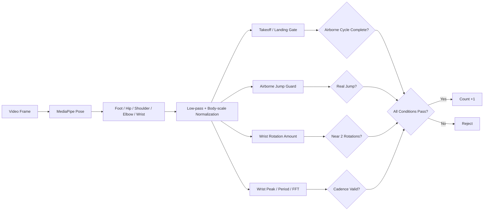
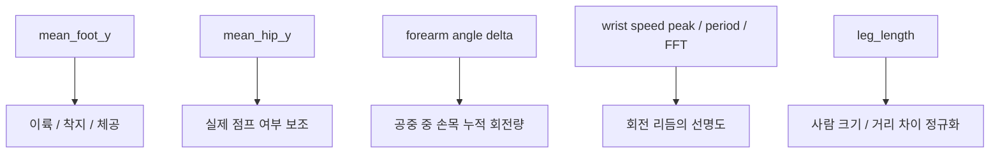
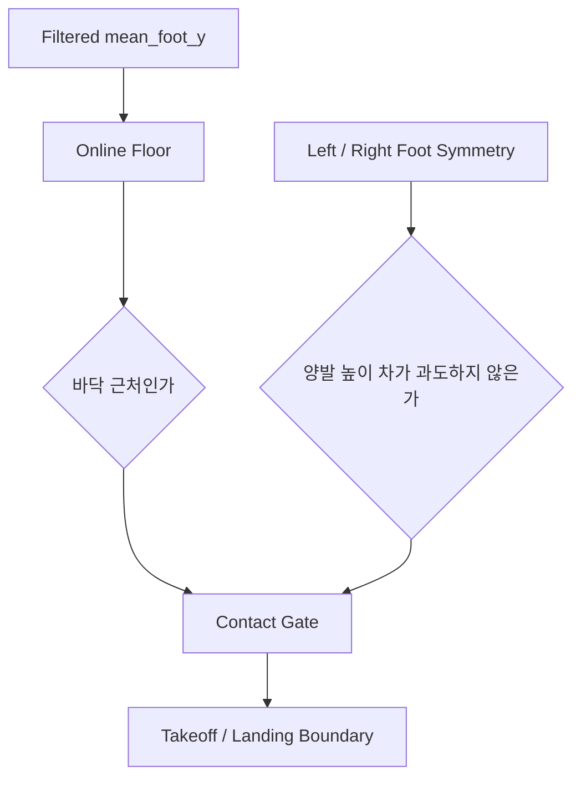
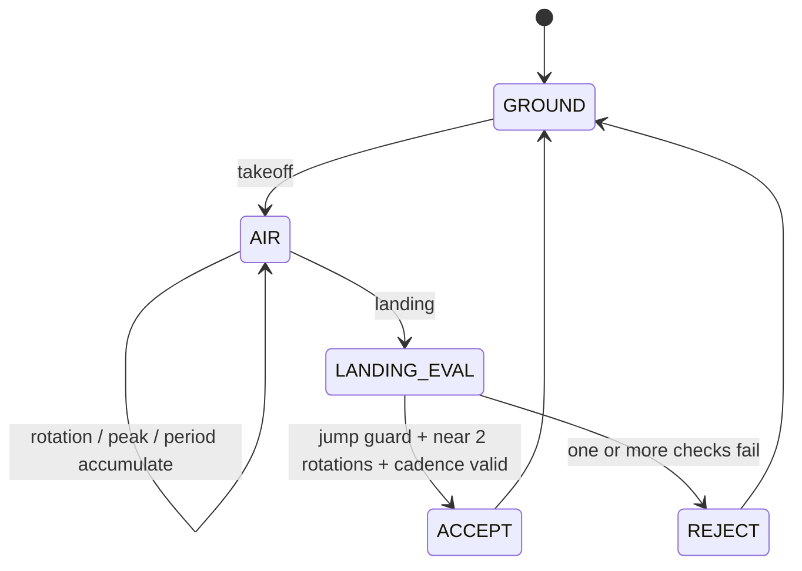
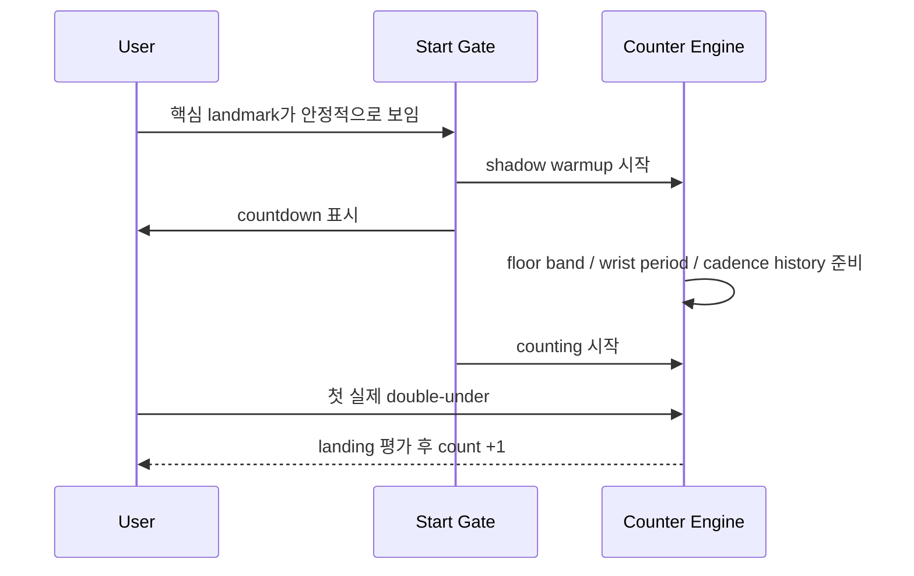

# double_jump Counter

이 문서는 `double_jump` 카운터가 **무엇을 세는지**, **어떤 신호를 보고 판단하는지**, **왜 손목 회전 주기 모니터링이 필요한지**를 개념 중심으로 설명한다.  
구체적인 threshold 숫자보다, 엔진이 어떤 순서로 생각하고 왜 그렇게 설계됐는지를 이해하는 데 초점을 둔다.

## 한눈에 보기

이 엔진은 MediaPipe Pose에서 사람의 자세를 읽고,

- `foot`으로 이륙과 착지를 구분하고
- `hip`으로 실제 점프가 있었는지 최소한의 점프 품질을 확인하고
- `wrist`의 회전량, peak, 주기, 주파수를 함께 본 뒤
- **공중 구간 동안 손목이 2회전에 가깝게 돌았을 때만** 1카운트한다.

즉, 단순히 높이 뛴 횟수를 세는 것이 아니라 **한 번의 점프 안에서 줄 2회전에 가까운 손목 패턴이 있었는지**를 더 중요하게 본다.



## 무엇을 1카운트로 보는가

이 프로젝트에서 1카운트는 아래 순간이다.

> 이륙 후 다시 착지하기 전까지 손목이 약 2회전에 가깝게 돌고, 그 구간이 실제 점프로 보이는 한 번의 airborne cycle

중요한 점은 세 가지다.

- 높이보다 **공중 중 손목 회전 수**가 더 중요하다.
- 손목 회전은 peak 개수 하나로만 보지 않고, **누적 회전량과 주기성**을 같이 본다.
- 착지 후 멈췄다가 다시 시작해도, 다음 double-under를 새 사이클로 다시 평가한다.

그래서 이 엔진은 “높게 떴다”만으로는 count하지 않고,  
**점프와 손목 회전이 double-under 패턴으로 결합됐을 때만** count한다.

## 어떤 신호를 보는가

실제 판단에 쓰는 핵심 신호는 네 묶음이다.



### `mean_foot_y`

좌우 발 높이 평균이다.  
이 신호는 바닥에서 떨어졌는지, 다시 닿았는지를 판단하는 데 쓴다.

즉, `foot`은 이 엔진에서 **air phase의 문을 여닫는 역할**을 한다.

### `mean_hip_y`

좌우 hip 평균 높이다.  
이 신호는 점프를 높이 세기 위한 것이 아니라, **손목만 흔들었는데 점프로 오해하는 상황을 막는 약한 보호 신호**다.

일반인과 선수는 점프 높이 차이가 크므로, 이 엔진은 hip 조건을 강하게 두지 않는다.  
대신 발 기반 체공과 손목 회전이 먼저 맞고, hip은 최소한의 jump guard 역할만 한다.

### `forearm angle delta`

이 엔진의 핵심은 손목 좌표 속도만이 아니라, **팔꿈치 기준 전완 각도의 누적 변화량**을 함께 본다는 점이다.

- 좌우 forearm angle을 프레임마다 계산하고
- 공중 구간에서 각도 변화량을 누적해서
- 손목이 실제로 몇 바퀴 정도 돌았는지 추정한다.

이렇게 해야 “짧고 빠른 흔들림”과 “실제 2회전에 가까운 회전”을 더 잘 구분할 수 있다.

### `wrist speed peak / period / FFT`

누적 회전량만으로는 landmark 튐이나 샘플링 오류를 완전히 막기 어렵다.  
그래서 엔진은 손목 회전을 세 겹으로 본다.

- 시간영역: 공중 중 wrist speed peak 개수와 peak 크기
- 주기영역: 최근 peak 간격으로 본 wrist period
- 주파수영역: FFT로 본 dominant wrist frequency와 power concentration

즉, 회전량이 2회전에 가깝더라도 리듬이 너무 불안정하면 reject할 수 있고,  
반대로 peak가 조금 뭉개져도 주기성과 회전량이 맞으면 accept 여지를 남긴다.

### `leg_length`

사람 크기와 카메라 거리 차이를 줄이기 위한 정규화 기준이다.

- jump height
- hip lift
- contact margin
- wrist motion scale

모두 이 값을 기준으로 정규화해서, 일반인과 선수의 절대 좌표 차이를 줄이려 한다.

## 왜 손목 회전 주기를 UI로 보여주는가

double-under는 사람마다 차이가 매우 크다.

- 일반인은 낮은 점프와 느린 회전으로 2회전에 가깝게 만들 수 있고
- 선수는 훨씬 짧은 체공 안에서도 빠르게 2회전을 끝낼 수 있다.

그래서 realtime UI에는 아래 값을 같이 표시한다.

- `Wrist period`
- `Wrist cadence`
- `Period confidence`
- 현재 air phase에서의 `rotation count`

이 값들은 threshold를 직접 노출하려는 목적이 아니라,  
**현재 사용자 패턴이 어떤 리듬으로 잡히는지 보고 보정에 쓰기 위한 모니터링 지표**다.

## 접지와 체공은 어떻게 판단하는가

접지는 절대 바닥 y를 고정값으로 두지 않는다.  
대신 현재 영상 안에서 발이 실제로 닿아 있는 높이 영역을 online floor처럼 갱신한다.



이후 air phase는 다음처럼 정의한다.

1. contact gate를 벗어나고 발 또는 hip이 일정 수준 이상 올라가면 이륙으로 본다.
2. 공중 구간에서는 wrist rotation evidence를 계속 누적한다.
3. 다시 contact gate로 돌아오면 한 번의 airborne cycle을 평가한다.

즉, 이 엔진은 **공중 한 구간 전체를 보고 판단**한다.

## 카운트는 어떤 순서로 올라가는가



말로 풀면 다음과 같다.

1. 지면 상태에서 이륙이 시작되면 air phase를 연다.
2. 공중 구간 동안 손목 누적 회전량, peak, 주기, FFT evidence를 모은다.
3. 착지 시점에 한 번만 평가한다.
4. 손목 회전이 2회전에 가깝고 jump guard가 통과하면 count를 올린다.
5. 착지 후 줄이 걸려 멈추더라도, 다음 이륙이 오면 새 사이클로 다시 평가한다.

## 왜 보호 로직이 필요한가

double-under 카운터는 손목 회전만 빠르다고 해서 안정적이지 않다.  
그래서 이 엔진은 여러 보호 로직을 같이 둔다.

### 1. 손목만 흔들었는데 count가 올라가는 문제

손목 회전 신호가 강해도 실제 점프가 아니면 count하면 안 된다.  
그래서 `foot` 기반 air phase와 `hip` 기반 jump guard를 함께 둔다.

### 2. 점프를 높게 못 뛰는 일반인 구간에서 미탐이 나는 문제

높이나 체공시간 threshold를 강하게 잡으면 일반인 샘플이 많이 잘린다.  
그래서 이 엔진은 점프 높이를 주신호로 쓰지 않고, **손목 2회전 근사 여부를 주신호**로 쓴다.

즉, 높이는 최소 보호 조건만 두고, 최종 accept는 회전량과 회전 리듬이 주도한다.

### 3. 선수처럼 매우 빠른 cadence에서 min gap이 방해되는 문제

빠른 리듬에서는 jump interval이 짧아진다.  
그래서 최근 accepted interval을 보고 빠른 cadence로 판단되면 `min gap`을 자동으로 줄인다.

### 4. 줄이 걸려 멈춘 뒤 다음 구간이 밀리는 문제

한 번의 실패 후 내부 상태가 꼬이면 다음 double-under까지 놓칠 수 있다.  
그래서 엔진은 공중 사이클 단위로 상태를 끊고, 착지 시점마다 air phase를 명확히 reset한다.

중요한 점은, reset은 air phase만 비우고 **최근 cadence profile은 남긴다**는 것이다.  
이렇게 해야 잠깐 멈췄다가 다시 시작해도 사용자의 기존 손목 리듬을 참조할 수 있다.

### 5. 사람마다 손목 속도가 크게 다른 문제

절대 속도 threshold 하나로는 선수와 일반인을 같이 다루기 어렵다.  
그래서 엔진은 최근 accepted cadence와 peak scale을 저장해 두고, 새 candidate를 **개인 리듬 프로파일과 비교**한다.

즉, 이 카운터는 절대 속도 하나보다

- 현재 cycle의 2회전 근사성
- 최근 wrist period
- 개인 cadence profile과의 유사도

를 함께 본다.

## realtime에서 왜 별도 시작 절차가 필요한가

realtime에서는 카메라에 사람이 들어오는 순간부터 곧바로 count를 올리면 오히려 UX가 나빠질 수 있다.  
아직 landmark가 흔들리거나 floor / cadence history가 적응 중이면 첫 몇 개가 불안정해지기 때문이다.

그래서 realtime 쪽에는 준비 절차가 있다.



핵심은 두 가지다.

- 시작 전에는 count를 올리지 않는다.
- 대신 그 시간 동안 엔진은 바닥 밴드와 손목 주기 히스토리를 미리 적응시킨다.

## 정리

이 카운터의 핵심은 아래 한 문장으로 요약된다.

> `foot`으로 공중 구간을 자르고, `wrist`의 누적 회전량과 주기를 중심으로 2회전 근사성을 판단하며, `hip`은 최소 jump guard로만 사용한다.

그래서 이 엔진은 단순한 높이 기반 점프 카운터가 아니라,

- 공중 한 사이클 안에서
- 손목이 실제로 2회전에 가깝게 돌았는지 보고
- 끊김 이후에도 다시 적응하며
- realtime UI에서 wrist period를 직접 모니터링할 수 있는

설명 가능한 double-under 전용 카운터로 구성되어 있다.

## Run

카메라 입력:

```bash
bash scripts/setup_env.sh
source activate
python double_jump/run_realtime_counter.py --source 0
```

시연 영상 저장:

```bash
source activate
python double_jump/run_realtime_counter.py --source 0 --save-output double_jump/artifacts/realtime_demo.mp4
```

데이터셋 검증:

```bash
source activate
MPLCONFIGDIR=/tmp/mpl python double_jump/run_dataset_eval.py
```

작은 grid search 후 검증:

```bash
source activate
MPLCONFIGDIR=/tmp/mpl python double_jump/run_dataset_eval.py --grid-search --search-limit 30
```
