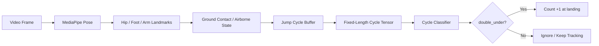
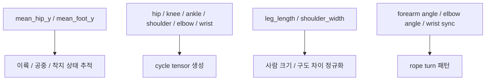
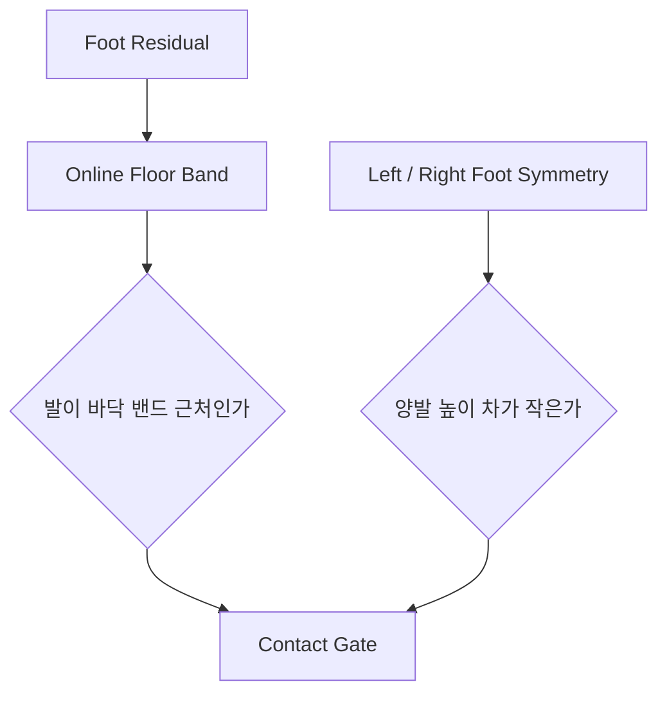
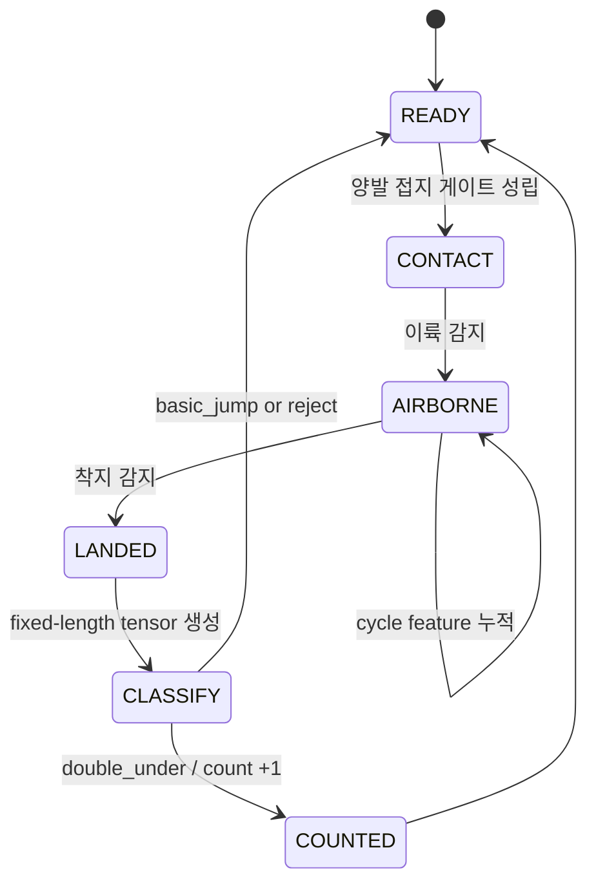
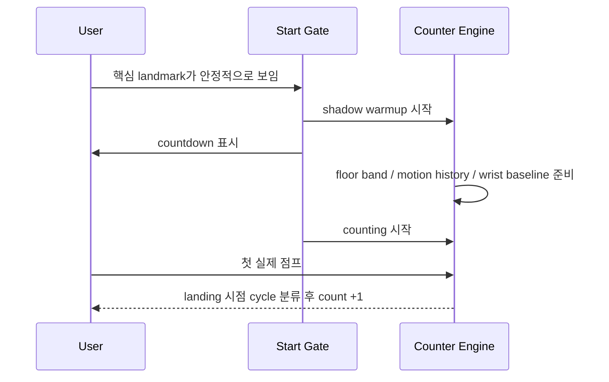

# double_jump Counter

이 문서는 `double_jump` 카운터가 **무엇을 세는지**, **어떤 신호를 보고 판단하는지**, **왜 cycle 단위 분류를 쓰는지**를 개념 중심으로 설명한다.  
구체적인 threshold 숫자보다, 엔진이 어떤 순서로 생각하고 왜 그렇게 설계됐는지를 이해하는 데 초점을 둔다.

## 한눈에 보기

이 엔진은 MediaPipe Pose에서 사람의 자세를 읽고,

- `foot`과 `hip`으로 실제 이륙과 착지를 추적하고
- `takeoff -> airborne -> landing` 구간을 하나의 jump cycle로 자른 뒤
- 그 cycle의 landmark 시계열을 분류해서 `double_under`로 판정된 경우에만 `+1` 카운트한다.

즉, 한 프레임 peak를 세는 방식이 아니라 **점프 1회 전체의 시간 패턴**을 보고 카운트한다.



## 무엇을 1카운트로 보는가

이 프로젝트에서 1카운트는 아래 순간이다.

> 한 번의 점프 cycle이 끝나고, 그 cycle 전체가 `double_under`로 분류된 착지 순간

중요한 점은 두 가지다.

- 카운트 기준은 공중 중간 spike가 아니라 cycle 종료 시점이다.
- 공중에 떴다는 사실만으로는 부족하고, 그 jump cycle의 손목/팔 패턴이 double under답게 보여야 한다.

그래서 이 엔진은 “한 프레임에서 손목이 빨랐는가”보다  
“이 점프 전체가 실제 2단 뛰기 패턴이었는가”를 더 중요하게 본다.

## 어떤 신호를 보는가

엔진은 많은 landmark를 직접 쓰지 않는다. 실제 카운트 판단에는 몇 가지 핵심 신호만 쓴다.



### `mean_hip_y` / `mean_foot_y`

좌우 hip과 foot의 평균 높이다.  
이 신호는 먼저 “지금이 실제 점프 cycle 안인가”를 판단하는 데 쓴다.

이유는 단순하다.

- 손목만 보면 rope 흉내 동작도 빨라 보일 수 있다.
- 실제 카운트 전에 점프 자체가 성립했는지는 하체가 먼저 설명해야 한다.

그래서 `double_jump`도 `basic_jump`처럼 foot/hip 기반 상태기계로  
실제 takeoff와 landing을 먼저 추적한다.

### `leg_length` / `shoulder_width`

같은 동작도 사람 키와 카메라 거리 때문에 크기가 다르게 보인다.  
그래서 cycle feature는 골반 중심 기준 상대좌표와 body scale로 정규화한다.

이 정규화가 필요한 이유는 명확하다.

- 가까이 선 사람의 손목 이동은 더 크게 보인다.
- 키가 큰 사람의 팔 각도 변화는 절대 픽셀 크기가 다르게 보인다.
- scale 정규화가 없으면 같은 2단 뛰기도 사람마다 다른 패턴처럼 보일 수 있다.

### `cycle tensor`

이 엔진의 핵심 입력이다.  
한 jump cycle 동안의 landmark를 고정 길이 시계열 텐서로 변환한다.

현재 구현은 아래 신호를 포함한다.

- shoulder / elbow / wrist의 골반 기준 상대좌표
- knee / ankle의 골반 기준 상대좌표
- forearm angle / upper-arm angle / elbow angle
- torso tilt
- ankle gap
- foot mean relative y
- wrist rotation ratio / wrist sync ratio / ankle flow ratio

즉 이 엔진은 “현재 프레임의 최대 속도”보다  
“점프 전체에서 관절 패턴이 어떤 순서로 나타났는가”를 본다.

## 접지를 어떻게 판단하는가

접지는 단순히 “발 y가 크다”로 보지 않는다.  
카메라마다 바닥의 절대 위치가 다르기 때문이다.

대신 엔진은 현재 영상 안에서 **발이 실제로 바닥에 닿아 있을 때 형성되는 높이 영역**을 계속 추적한다. 이를 여기서는 `바닥 밴드`라고 부른다.



접지 게이트는 두 조건을 함께 본다.

- 현재 발 residual이 바닥 밴드 근처인가
- 좌우 발 높이 차가 과도하지 않은가

이렇게 해야 이륙 전후의 발 흔들림과 실제 착지를 구분하기 쉽다.

## 카운트는 어떤 순서로 올라가는가

카운트는 두 단계로 관리한다.

1. `foot / hip` 상태기계가 점프 cycle을 분할한다.
2. cycle 분류기가 그 점프가 `double_under`인지 판정한다.



이 흐름을 말로 풀면 이렇다.

1. 먼저 양발이 접지 상태인지 확인한다.
2. takeoff가 시작되면 jump cycle 버퍼를 연다.
3. airborne 동안 landmark feature를 계속 쌓는다.
4. landing 시점에 cycle을 닫고 고정 길이 텐서로 resample한다.
5. cycle classifier가 `double_under`로 판정하면 그 landing frame에서 count를 올린다.

여기서 중요한 설계 원칙은 **한 점프 안에서 여러 번 흔들리는 신호를 프레임 단위로 세지 않는 것**이다.  
그래서 한 cycle은 최대 한 번만 count된다.

## 왜 cycle 분류가 필요한가

2단 뛰기는 본질적으로 `한 번의 점프 안에서 줄이 두 번 도는 시간 구조`를 가진다.  
이 패턴은 단일 threshold보다 짧은 시계열 분류에서 더 잘 드러난다.

단순 wrist speed 방식만 쓰면 다음 문제가 생긴다.

- 한 번만 줄이 지나가도 순간 peak가 크게 튈 수 있다.
- 공중 중간에 spike가 여러 번 생기면 같은 점프를 중복 카운트하기 쉽다.
- camera distance나 손목 가림에 따라 threshold가 크게 흔들린다.

반면 cycle 분류는,

- takeoff부터 landing까지의 전체 패턴을 보고
- 손목 / 팔 / 하체 정보를 함께 쓰며
- 최종 카운트를 cycle 종료 시점에 한 번만 확정한다.

이 구조가 double under에 더 잘 맞는 이유는,  
2단 뛰기를 “속도 peak”가 아니라 “점프 1회의 시간 패턴”으로 보기 때문이다.

## 왜 보호 로직이 필요한가

cycle classifier가 있어도 보호 로직은 필요하다.  
실제 realtime 영상에서는 잘못된 cycle 자체가 들어올 수 있기 때문이다.

### 1. 점프가 아닌데 cycle처럼 보이는 문제

상체 흔들림이나 발장난이 잠깐 airborne처럼 보일 수 있다.  
그래서 classifier보다 먼저 `takeoff / landing` 상태기계가 실제 점프 구간만 자른다.

### 2. 점프는 했지만 너무 짧거나 낮은 경우

실제 double under라면 최소한의 airtime과 jump height가 있어야 한다.  
그래서 cycle classifier 결과와 별개로 `airtime`, `jump_height`, `hip/foot range` guard를 함께 둔다.

### 3. 같은 점프를 두 번 세는 문제

한 cycle 안에서는 여러 frame이 강한 패턴을 만들 수 있다.  
그래서 count는 airborne 중간이 아니라 landing 시점에 한 번만 확정한다.

### 4. 빠른 cadence에서 undercount가 나는 문제

연속 2단 뛰기 구간에서는 accepted interval이 짧아진다.  
그래서 최근 accepted cadence를 보고 `min gap`을 자동으로 줄이는 adaptive guard를 유지한다.

## realtime에서 왜 별도 시작 절차가 필요한가

realtime에서는 카메라에 사람이 들어오는 순간부터 곧바로 count를 올리면 첫 몇 개가 흔들리기 쉽다.  
그래서 준비 절차가 있다.



핵심은 두 가지다.

- 시작 전에는 count를 올리지 않는다.
- 대신 그 시간 동안 엔진은 바닥 밴드와 motion history를 미리 적응시킨다.

이렇게 해야 첫 점프부터 cycle 분류가 더 안정적으로 들어간다.

## 정리

이 카운터의 핵심은 아래 한 문장으로 요약된다.

> `foot / hip`으로 jump cycle을 자르고, `landmark time-series classifier`로 그 cycle이 실제 `double_under`인지 판정한 뒤 landing 시점에만 count한다.

그래서 이 엔진은 단순 peak detector가 아니라,

- 실제 점프 cycle을 먼저 분할하고
- 그 cycle 전체의 관절 패턴을 분류하며
- drift와 중복 카운트를 별도 로직으로 막는

설명 가능한 온라인 카운터로 구성되어 있다.

## Run

사전 준비:

```bash
bash scripts/setup_env.sh
source activate
```

기본 학습 모델 재생성:

```bash
source activate
python double_jump/train_cycle_classifier.py \
  --video-dir videos/double_jump_video \
  --label-dir videos/double_jump_video \
  --output double_jump/artifacts/cycle_classifier.json
```

카메라 입력:

```bash
source activate
python double_jump/run_realtime_counter.py --source 0
```

모델 파일을 직접 지정해서 실행:

```bash
source activate
python double_jump/run_realtime_counter.py \
  --source 0 \
  --classifier-model-path double_jump/artifacts/cycle_classifier.json
```

시연 영상 저장:

```bash
source activate
python double_jump/run_realtime_counter.py \
  --source 0 \
  --save-output double_jump/artifacts/realtime_demo.mp4
```

데이터셋 검증:

```bash
source activate
MPLCONFIGDIR=/tmp/mpl python double_jump/run_dataset_eval.py \
  --video-dir videos/double_jump_video \
  --label-dir videos/double_jump_video
```

검증 결과 UI 영상 생성:

```bash
source activate
MPLCONFIGDIR=/tmp/mpl python double_jump/run_dataset_eval.py \
  --video-dir videos/double_jump_video \
  --label-dir videos/double_jump_video \
  --output-dir videos/double_jump_video_results \
  --render-videos
```

생성 결과:

- `double_jump/artifacts/cycle_classifier.json`
- `double_jump/output/dataset_eval_results.json`
- `double_jump/output/dataset_eval_report.txt`
- `videos/double_jump_video_results/*_validation.mp4`
