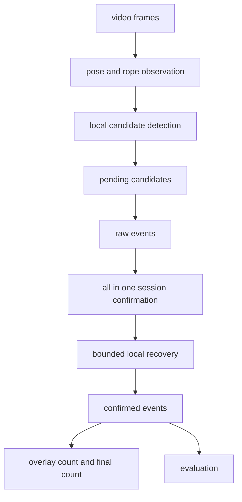
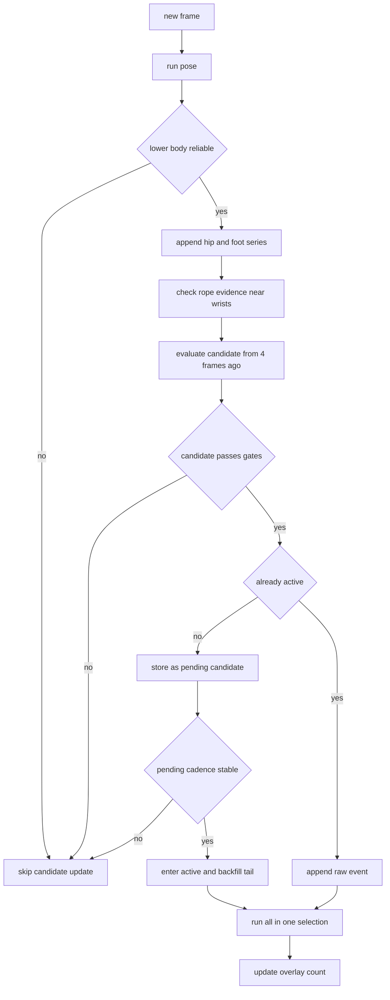
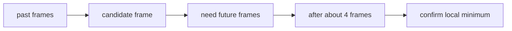
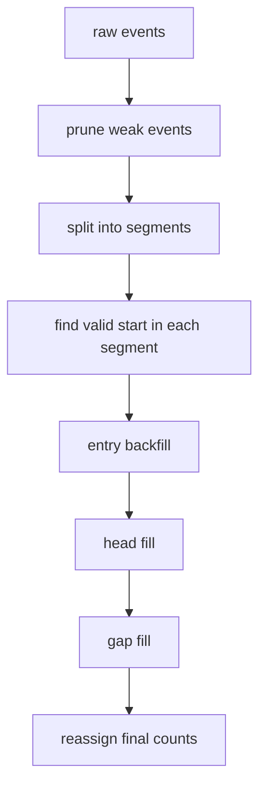
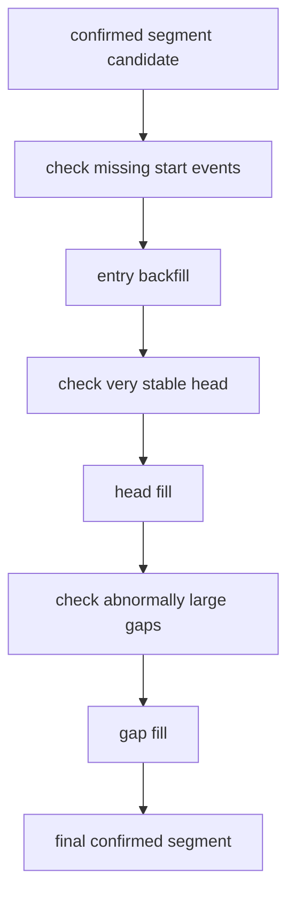

# Basic Jump Detector Tech Docs

## 1) Purpose

이 문서는 현재 `basic_jump` 엔진이 `왜` 그렇게 동작하는지, 그리고 `어떤 논리`로 줄넘기 count를 만드는지를 전공자 기준에서 아주 쉽게 설명하기 위한 문서입니다.

설명의 기준은 아래와 같습니다.

- 코드의 현재 운영 경로를 기준으로 설명합니다.
- 단순 사용법보다 `원리`와 `설계 의도`를 우선합니다.
- 수학식이나 구현 디테일이 있어도, 먼저 `직관`을 설명하고 그다음 `조건`을 설명합니다.

현재 운영 기준의 핵심은 아래 두 가지입니다.

- 기본 엔진은 `all-in-one` 온라인 확정 엔진입니다.
- 전체 영상을 다시 스캔해서 count를 뒤집는 offline 재검출 경로는 운영 기준이 아닙니다.

즉 이 시스템의 목표는 단순히 jump event를 많이 잡는 것이 아니라,
`라이브에서 보인 숫자`와 `마지막 저장 숫자`가 같은 의미를 갖도록 만드는 것입니다.

## 2) Design Goals

현재 설계 목표는 아래와 같습니다.

- `final_count = online_confirmed_count`
- 라이브 count와 종료 후 count가 다른 규칙으로 계산되지 않음
- count는 가능하면 monotonic하게 증가하고 rollback하지 않음
- no-jump, walk, 짧은 흔들림 같은 장면에서 숫자가 먼저 올라갔다가 사라지는 UX를 줄임
- 지연은 전체 영상 길이에 의존하지 않고, 세션 시작 prefix와 국소 gap 보정에만 의존함

이 문장을 한 줄로 줄이면 아래와 같습니다.

- `빨리 세는 것`보다 `맞는 숫자를 끝까지 유지하는 것`이 더 중요하다.

## 3) Core Vocabulary

이 문서를 이해하려면 아래 용어를 먼저 잡고 가는 것이 좋습니다.

- `frame`
  - 비디오의 한 장면입니다.
- `landmark frame`
  - MediaPipe pose가 정상적으로 잡혀서 hip/foot 시계열에 실제로 들어간 프레임입니다.
  - 아래에서 말하는 `4프레임`, `6프레임` 같은 값은 엄밀히는 이 기준입니다.
- `candidate_idx`
  - 현재 프레임에서 지금 막 평가하는 과거 후보 위치입니다.
  - 현재 구현은 `현재 landmark 인덱스 - 4`를 평가합니다.
- `local candidate`
  - 한 프레임 근처에서 `점프처럼 보인다`고 판단된 후보입니다.
  - 아직 최종 count는 아닙니다.
- `pending candidate`
  - inactive 상태에서 잠시 모아두는 local candidate입니다.
  - 줄넘기 세션이 시작됐는지 보기 위한 재료입니다.
- `raw event`
  - `detected_jump_events`에 실제로 들어간 이벤트입니다.
  - 프레임 루프가 세션 시작을 어느 정도 인정한 뒤 생깁니다.
- `confirmed event`
  - `all-in-one` 선택기를 통과한 최종 이벤트입니다.
  - 화면 count와 저장 count는 이것을 기준으로 합니다.
- `cadence`
  - 연속 jump 간 시간 간격의 규칙성입니다.
  - 줄넘기는 대체로 비슷한 간격으로 반복되므로, cadence가 안정적이면 진짜 점프열일 가능성이 높습니다.
- `cadence CV`
  - `std(gap) / mean(gap)` 입니다.
  - 값이 낮을수록 간격이 더 규칙적이라는 뜻입니다.
- `rope ratio`
  - 최근 짧은 시간 동안 손목 근처 ROI에서 rope 흔적이 보인 비율입니다.
- `rope dual ratio`
  - 좌우 손목에서 rope 흔적이 동시에 보인 비율입니다.
- `bilateral / symmetry`
  - 양발이 함께 들렸는지, 좌우 발 움직임이 대칭적인지에 대한 증거입니다.
- `strength ratio`
  - hip local minimum의 prominence를 최근 움직임 규모로 정규화한 값입니다.
  - 단순 높낮이 자체가 아니라 `최근 움직임 대비 얼마나 점프답게 깊은가`를 나타냅니다.
- `strong positive event`
  - strength ratio와 foot prominence가 충분히 큰 raw event입니다.
  - 세션 시작을 강하게 지지하는 증거로 씁니다.
- `heuristic threshold`
  - 이론적으로 고정된 상수가 아니라, 대표 영상과 UX를 보고 튜닝한 운영 threshold입니다.
  - `3개`, `4개`, `0.8초`, `1.5배` 같은 값이 여기에 속합니다.
- `strict / adjusted / full`
  - `strict`: label window 내부에서 직접 비교한 지표
  - `adjusted`: label gap candidate를 제외한 지표
  - `full`: label window 밖 confirmed extra까지 포함한 지표
- `label_boundary_candidate`
  - 첫/마지막 label 바로 바깥에 있지만 cadence상 같은 점프열로 이어지는 평가용 경계 이벤트입니다.
- `raw commit lag` / `positive commit lag`
  - `raw_commit_lag_ms = overlay_count_reached_ts - final_event_ts`
  - UX 평가는 `positive_commit_lag_ms = max(0, raw_commit_lag_ms)`로 해석합니다.

## 4) High-Level Mental Model

이 엔진은 `프레임 1장만 보고 바로 +1` 하는 이벤트 카운터가 아닙니다.

더 정확히는 아래와 같은 `2단계 확정기`입니다.

1. 프레임 루프가 `점프처럼 보이는 local candidate`를 찾습니다.
2. 그 후보들이 반복 리듬을 만들면 `raw event`로 승격합니다.
3. 그 raw event들이 진짜 줄넘기 세션을 이룬다고 판단되면 `confirmed event`가 됩니다.
4. 화면과 저장은 confirmed event만 씁니다.

이 구조를 이해할 때 가장 중요한 포인트는 아래 두 가지입니다.

- `raw event`와 `confirmed event`는 다릅니다.
- `2개 후보`, `3개 raw event`, `4개 raw event`는 서로 다른 단계의 threshold입니다.

## 5) Why Session-Based Counting Is Necessary

왜 이렇게 복잡하게 하냐면, 줄넘기처럼 보이는 장면 1번만으로는 아직 확실하지 않기 때문입니다.

실제 현장에서는 아래 같은 장면이 점프로 오인될 수 있습니다.

- 사람이 제자리에서 살짝 튀는 장면
- 걸으면서 발이 번갈아 들리는 장면
- 줄이 손 근처에서 잠깐 잘못 보이는 장면
- pose landmark가 잠깐 흔들리는 장면

이런 장면을 보자마자 바로 count하면 문제가 생깁니다.

- 오탐이 늘어납니다.
- 나중에 그 숫자를 다시 내려야 합니다.
- 사용자는 `라이브에서 5를 봤는데 왜 저장 결과는 4지?`라고 느끼게 됩니다.

그래서 현재 구조는 아래 전략을 씁니다.

- 먼저 `점프 같아 보이는 것`을 넓게 모읍니다.
- 그다음 `진짜 줄넘기 리듬인지`를 좁게 확인합니다.
- 화면에는 최종적으로 확인된 것만 보여줍니다.

이 문장을 엔진 관점으로 바꾸면 아래와 같습니다.

- `후보 검출은 넓게, count 확정은 보수적으로`

## 6) Stage 1: What Happens On Every Frame

프레임 루프는 매 프레임마다 아래 일을 합니다.

1. frame timestamp를 정합니다.
2. MediaPipe pose를 돌립니다.
3. 하체 landmark가 충분히 믿을 만한지 검사합니다.
4. hip center, foot center, 좌우 발 좌표를 시계열에 쌓습니다.
5. 손목 ROI 주변에서 rope 흔적을 찾고 rope flag 시계열에 쌓습니다.
6. 현재 시점에서 `4프레임 전 후보`를 local candidate로 평가합니다.
7. 후보가 통과하면 pending candidate 또는 raw event로 반영합니다.
8. raw event 리스트가 바뀌면 all-in-one 선택기를 다시 돌립니다.

### 6.1 Lower-Body Reliability

strict 모드에서는 `몸이 제대로 보인 프레임만` 신뢰합니다.

기본 조건은 아래와 같습니다.

- 양쪽 hip가 모두 신뢰 가능해야 함
- 좌/우 하체에서 각 측 최소 1개 이상의 주요 landmark가 신뢰 가능해야 함

이 단계가 필요한 이유는 아래와 같습니다.

- hip minima와 foot motion은 landmark 품질에 크게 의존합니다.
- landmark가 흔들리면 점프처럼 보이는 가짜 minima가 쉽게 생깁니다.

즉 이 단계는 `좋은 입력만 다음 단계로 보낸다`는 의미입니다.

### 6.2 Rope Evidence Is Local, Not Global

이 엔진은 줄 전체를 영상에서 추적하지 않습니다.

대신 아래 원리를 씁니다.

- 먼저 손목 근처의 작은 네모 영역만 봅니다.
  - 이것이 `ROI(Region Of Interest)`입니다.
  - 말 그대로 `지금 관심 있는 작은 구역`입니다.
  - 현재 구현은 왼손과 오른손 각각에 대해 손목 근처 약 `70x70` 픽셀 상자를 잡습니다.
- 그 다음 배경 제거기(KNN background subtractor)로 `지금 새롭게 움직인 부분`만 흰색으로 남깁니다.
  - 이것이 `foreground mask`입니다.
  - 쉽게 말하면 `가만히 있는 배경은 지우고, 움직인 조각만 남긴 흑백 지도`입니다.
- 그 흰색 조각들의 바깥 경계를 찾습니다.
  - 이것이 `contour`입니다.
  - contour는 어떤 물체 덩어리의 `테두리선`이라고 생각하면 됩니다.
  - 흰색 얼룩이 하나 있으면, contour는 그 얼룩을 둘러싸는 외곽선 점들의 집합입니다.
- contour가 rope처럼 `가늘고 길게` 보이면 rope 흔적으로 봅니다.
  - 너무 작은 조각은 버립니다.
  - 너무 뭉툭하고 네모난 조각도 버립니다.
  - 길이는 어느 정도 있는데 두께가 얇은 조각만 남깁니다.
- 좌우 중 하나라도 보이면 `rope_flag`
- 좌우 모두 보이면 `rope_dual_flag`
- 최근 짧은 시간 창에서 이 플래그들의 비율을 계산합니다.

조금 더 구체적으로 보면, 코드에서는 각 contour에 대해 아래를 확인합니다.

- `area`
  - 너무 작은 잡음 조각인지 확인합니다.
- `bounding box`
  - contour를 감싸는 가장 작은 직사각형입니다.
  - 여기서 가로와 세로를 보고 `긴 변`과 `짧은 변`을 구합니다.
- `aspect ratio`
  - `짧은 변 / 긴 변`입니다.
  - 값이 작을수록 `가늘고 긴 조각`입니다.
  - 줄은 대체로 이런 모양일 가능성이 높고, 몸통이나 큰 그림자 조각은 이런 비율이 잘 나오지 않습니다.
- `perimeter`
  - contour 둘레 길이입니다.
  - 둘레가 너무 짧으면 rope라기보다 작은 점 잡음일 가능성이 높습니다.

그 다음 contour의 점들 중 하나라도 손목 ROI 안에 들어오면:

- 왼쪽 ROI면 `left_roi_hit = True`
- 오른쪽 ROI면 `right_roi_hit = True`
- 둘 중 하나라도 참이면 이 프레임의 `rope_flag = True`
- 둘 다 참이면 이 프레임의 `rope_dual_flag = True`

구현 관점에서 `가늘고 길다`는 아래처럼 판단합니다.

1. `area`가 너무 작으면 버립니다.
   - 작은 점 잡음, 센서 노이즈, 배경 깜빡임을 제거하기 위함입니다.
2. `bounding box`를 구합니다.
   - contour를 감싸는 가장 작은 가로세로 직사각형입니다.
3. 직사각형의 `긴 변(long_side)`과 `짧은 변(short_side)`를 구합니다.
4. `긴 변`이 너무 짧으면 버립니다.
   - rope라면 어느 정도 길이 방향으로 뻗어 있어야 하기 때문입니다.
5. `aspect_ratio = short_side / long_side`를 계산합니다.
   - 값이 `1`에 가까우면 정사각형처럼 뭉툭한 조각입니다.
   - 값이 `0`에 가까울수록 선처럼 길쭉한 조각입니다.
   - rope는 보통 이런 `낮은 aspect ratio`를 가질 가능성이 높습니다.
6. `perimeter`가 너무 짧으면 버립니다.
   - 작고 단순한 점 잡음을 다시 한 번 걸러내기 위함입니다.
7. 마지막으로, 살아남은 contour의 점이 손목 ROI 안에 실제로 닿는지 확인합니다.
   - 손과 상관없는 멀리 있는 조각은 rope evidence로 쓰지 않습니다.

## 7) Stage 2: Why The Detector Has A 4-Frame Delay

현재 구현은 `LOCAL_MINIMA_LAG_FRAMES = 4`를 사용합니다.

이 값이 뜻하는 바는 아래와 같습니다.

- 현재 프레임이 들어왔을 때
- `지금 프레임`을 점프로 판정하는 것이 아니라
- `4프레임 전 위치`가 local minimum이었는지를 판정합니다.

왜 이런 지연이 필요하냐면 local minimum은 `오른쪽 이웃`이 있어야 확인되기 때문입니다.

예를 들어 어떤 프레임이 진짜 바닥인지 알려면:

- 왼쪽보다 낮아야 하고
- 오른쪽보다도 낮아야 합니다.

즉 미래 정보가 조금 필요합니다.

이 `4프레임`은 엔진이 causal하게 동작하기 위해 치르는 최소 지연 중 하나입니다.

### 7.1 Hip Amplitude Is Adaptive, Not Fixed

hip minima를 볼 때 고정 높이 threshold만 쓰지 않습니다.

원리는 아래와 같습니다.

- 최근 hip 움직임에서 변화량 분포를 봅니다.
- median과 MAD 기반 spread를 이용해 적응형 threshold를 만듭니다.
- 현재 minima prominence를 그 threshold로 나누어 `strength ratio`를 계산합니다.

이렇게 하는 이유는 아래와 같습니다.

- 사람마다 키와 자세가 다릅니다.
- 영상 크기와 촬영 각도도 다릅니다.
- 같은 사람도 세션마다 움직임 크기가 다를 수 있습니다.

즉 `얼마나 많이 내려갔나`보다 `최근 움직임 대비 얼마나 점프답게 내려갔나`를 보는 것입니다.

### 7.2 Foot Motion Signature

hip minima만으로는 충분하지 않기 때문에, 발 움직임도 같이 봅니다.

주요 체크는 아래와 같습니다.

- foot center lift prominence
- 좌우 발이 모두 들렸는지
- 좌우 발 prominence가 너무 비대칭은 아닌지
- 좌우 발 속도 변화가 어느 정도 동기적인지
- 필요하면 발 중심이 너무 많이 옆으로 이동하지 않는지

이 단계는 `hip가 내려갔다`를 `실제로 점프한 모양이었다`로 바꿔주는 단계입니다.

### 7.3 Anti-Walk Gate

걷기는 줄넘기와 비슷한 위아래 흔들림을 만들 수 있습니다.

그래서 strict 모드에서는 아래와 같은 walk 패턴을 막습니다.

- 좌우 발이 번갈아 움직이는 비동기 패턴
- 발 중심이 옆으로 많이 이동하는 패턴
- bilateral 증거가 약한 unilateral 패턴

즉 이 단계는 `jump-like motion`과 `walk-like motion`을 분리하려는 장치입니다.

### 7.4 Candidate Gate Is An AND Condition

실제로 local candidate가 만들어지려면 아래 조건이 함께 만족되어야 합니다.

- startup lockout 구간이 아니어야 함
- hip local minimum이어야 함
- strength ratio가 최소값 이상이어야 함
- foot motion gate를 통과해야 함
- 이전 jump와 최소 간격 이상 떨어져 있어야 함
- 최근 rope evidence가 충분해야 함

즉 엔진은 `한 가지 증거`만 보고 점프를 만들지 않습니다.
`hip`, `foot`, `rope`, `time gap`이 함께 맞아야 local candidate를 만듭니다.

추가로 상태에 따라 gate 강도가 조금 다릅니다.

- inactive 상태
  - 세션 시작을 여는 단계이므로 더 보수적입니다.
  - bilateral foot motion과 rope evidence를 더 엄격하게 봅니다.
- active 상태
  - 이미 세션 안이라고 보고 있으므로 조금 더 유연합니다.
  - 최근 motion history가 좋으면 borderline candidate를 살릴 수 있습니다.

또한 entry/active 단계에는 일부 override나 bootstrap 경로가 있습니다.

- rope와 strength evidence가 매우 강하면 약간 부족한 발 모션을 보완할 수 있습니다.
- 세션 시작 직후에는 no-flag bootstrap으로 초기 진입을 살릴 수 있습니다.

이 예외 경로의 목적은 아래와 같습니다.

- 좋은 세션 시작을 너무 많이 놓치지 않기 위함
- 그렇다고 walk/no-jump까지 쉽게 통과시키지 않기 위함

## 8) Stage 3: From Local Candidate To Raw Event

local candidate가 바로 raw event가 되는 것은 아닙니다.

여기서 active/inactive 상태가 들어갑니다.

### 8.1 Inactive State

inactive 상태에서는 엔진이 아직 `줄넘기 세션이 시작됐다`고 믿지 않습니다.

그래서 후보가 통과해도 바로 raw event로 넣지 않고 `pending_candidates`에 모읍니다.

현재 기본 동작은 아래와 같습니다.

- 최근 `0.8초` 창 안에서 pending candidate를 유지
- 최소 `2개` 후보가 필요
- 간격이 너무 벌어지지 않아야 함
- cadence CV가 너무 크지 않아야 함

즉 이 단계는 `줄넘기 시작 같음`을 확인하는 1차 진입 게이트입니다.

### 8.2 Active State

pending candidate들이 리듬을 만들면 active 상태로 들어갑니다.

그 순간 엔진은:

- 최근 pending candidate 중 일부를 backfill해서 raw event로 승격하고
- 이후의 valid candidate는 바로 raw event로 추가합니다

여기서 중요한 점은 아래와 같습니다.

- `2개 후보`는 raw event를 만들기 위한 시작 게이트입니다.
- 하지만 이것만으로 화면 count가 올라가는 것은 아닙니다.

즉 `2개`는 `세션 시작 가능성`을 여는 값이지, 최종 count 확정값이 아닙니다.

### 8.3 Event Timestamp Is Shifted On Purpose

raw event를 만들 때 timestamp와 frame은 후보 프레임 그대로 쓰지 않습니다.

현재 기본값:

- `LANDING_OFFSET_MS = 100`
- `EVENT_TIME_BIAS_MS = 100`

의도는 아래와 같습니다.

- minima가 검출된 순간보다 실제 사람이 체감하는 착지 타이밍에 더 가깝게 맞추기 위함
- overlay 진행과 eval timestamp를 더 자연스럽게 맞추기 위함

즉 저장되는 event timestamp는 `검출 계산용 내부 프레임`과 `사용자/평가용 시간축`을 조금 분리한 결과입니다.

## 9) Stage 4: Raw Event Is Still Not Final Count

여기서 가장 많이 헷갈리는 부분이 나옵니다.

- `raw event`는 이미 꽤 엄격한 검사를 통과한 이벤트입니다.
- 하지만 그래도 아직 `최종 count`는 아닙니다.

왜냐하면 raw event 단계는 여전히 `후보를 넉넉하게 모으는 단계`이기 때문입니다.

실제 화면과 저장은 raw event를 다시 한 번 세션 단위로 확인한 결과만 씁니다.

즉 현재 구조는 아래 2단계 확정을 합니다.

| 단계 | 입력 | 출력 | 기본 최소 개수 | 목적 |
| --- | --- | --- | --- | --- |
| 프레임 루프 진입 게이트 | local candidate | raw event | `2개 후보` | 세션이 시작됐는지 대략 판단 |
| all-in-one 세션 확정 | raw event | confirmed event | `3개` 또는 `4개 raw event` | 사용자에게 보여줄 count 확정 |

이 표가 중요한 이유는 아래와 같습니다.

- `왜 2개인데 화면에는 3이나 4가 뜨지?`라는 질문의 답이 여기 있습니다.
- `2개`와 `3/4개`는 서로 다른 단계의 threshold입니다.

## 10) Stage 5: All-In-One Session Confirmation

`_select_all_in_one_events()`는 raw event 리스트를 보고,
어떤 이벤트를 최종 confirmed event로 인정할지 결정합니다.

처리 순서는 아래와 같습니다.

1. weak non-bilateral event를 먼저 prune
2. 큰 gap 기준으로 raw event를 segment로 분리
3. 각 segment의 prefix를 늘려 가며 `유효한 시작점`을 탐색
4. 필요하면 entry backfill 적용
5. 필요하면 head fill 적용
6. 긴 안정 세션이면 gap fill 적용
7. 최종 선택된 이벤트에 count를 다시 부여

### 10.1 Why The First Visible Count Is Often 3 Or 4

세션 시작을 확정하려면 `리듬이 실제로 존재한다`는 증거가 더 필요합니다.

현재 기본값은 아래와 같습니다.

- `ALL_IN_ONE_STRONG_ENTRY_MIN_EVENTS = 3`
- `ALL_IN_ONE_STABLE_ENTRY_MIN_EVENTS = 4`

이 값들은 `휴리스틱한 최소 증거 개수`입니다.

중요:

- 수학적으로 증명된 상수는 아닙니다.
- 모델이 학습으로 자동 추정한 값도 아닙니다.
- 대표 세션에서 `오탐 감소`와 `초기 지연`의 균형을 보고 튜닝한 운영 threshold입니다.

하지만 `3` 또는 `4`만 맞는다고 통과하는 것은 아닙니다.

추가로 아래도 함께 봅니다.

- cadence CV가 충분히 낮은지
- rope ratio가 충분한지
- dual rope ratio가 충분한지
- strong positive event가 최소 개수 이상 있는지
- bilateral 또는 symmetry 증거가 있는지

즉 `3개`와 `4개`는 `필요조건 중 하나`이지 `충분조건`이 아닙니다.

### 10.2 Start Reason Types

세션 시작 판정은 현재 세 가지 유형이 있습니다.

| 시작 유형 | 최소 raw event 수 | 추가 의미 |
| --- | --- | --- |
| `strong_high_dual` | `3` | cadence가 안정적이고 rope와 dual rope 증거가 모두 강한 시작 |
| `strong_low_dual` | `3` | dual 증거는 약하지만 rope와 strong-positive evidence가 충분한 시작 |
| `stable` | `4` | 조금 더 긴 prefix를 보고 안정성을 확인한 시작 |

현재 기본 조건을 더 코드 가깝게 적으면 아래와 같습니다.

| 시작 유형 | 기본 길이 | cadence 조건 | rope 조건 | 추가 조건 |
| --- | --- | --- | --- | --- |
| `strong_high_dual` | `>= 3` | `CV <= 0.20` | `median rope >= 0.55`, `median dual >= 0.25` | `strong positive >= 2`, bilateral/symmetry 존재 |
| `strong_low_dual` | `>= 3` | `CV <= 0.20` | `median rope >= 0.55` | `strong positive >= 2`, bilateral/symmetry 존재 |
| `stable` | `>= 4` | `CV <= 0.22` | `median rope >= 0.50` | `strong positive >= 2`, bilateral/symmetry 존재, `median abs foot prominence >= 0.0005` |

이 세 유형을 둔 이유는 아래와 같습니다.

- 모든 좋은 세션이 똑같이 강한 dual rope 증거를 주지는 않습니다.
- 너무 한 가지 패턴만 허용하면 recall이 줄어듭니다.
- 반대로 너무 느슨하면 walk/no-jump 오탐이 늘어납니다.

즉 여러 시작 유형은 `오탐을 크게 늘리지 않으면서 실제 세션의 다양성`을 받기 위한 절충입니다.

## 11) Stage 6: Bounded Local Recovery

현재 엔진은 `전체 영상을 다시 스캔해서 과거를 다시 해석`하지 않습니다.

대신 이미 확정된 segment 주변에서만 작은 국소 보정을 허용합니다.

이유는 아래와 같습니다.

- 온라인 causal detector는 시작 직전 1~2개를 늦게 잡을 수 있습니다.
- 긴 안정 세션 안에서 단일 gap 누락이 생길 수 있습니다.
- 그렇다고 전체 영상을 다시 뒤집으면 `live=final`이 깨질 수 있습니다.

그래서 현재 구조는 `bounded recovery`만 허용합니다.

### 11.1 Entry Backfill

의미:

- 세션 시작점 바로 앞에 있던 실제 raw event를 다시 포함하는 과정입니다.

현재 기본값:

- 최대 `2개`
- 시작부 reference cadence와 비슷한 gap이어야 함
- 약한 가짜 이벤트는 다시 넣지 않음

직관:

- `진짜로는 세션 시작인데, 온라인 확정이 살짝 늦어서 앞 1~2개가 빠졌다면 다시 살려준다`

### 11.2 Head Fill

의미:

- 실제 앞 이벤트가 없더라도, 초반 cadence가 매우 안정적이면
- 맨 앞 synthetic event를 외삽해서 넣는 과정입니다.

직관:

- `시작 리듬이 너무 일정하면, 실제로는 바로 앞에도 같은 리듬이 있었을 가능성이 높다`

이 단계는 entry backfill이 없을 때만 조심해서 씁니다.

### 11.3 Gap Fill

의미:

- 긴 안정 세션 내부에서 event 간 gap이 평소보다 비정상적으로 크면
- 그 사이에 빠진 jump가 있다고 보고 interpolation event를 넣는 과정입니다.

현재 기본 조건:

- segment 길이 `12개 event 이상`
- cadence CV가 충분히 낮음
- gap이 median gap의 최소 `1.5배`
- gap당 삽입 수와 전체 삽입 수 모두 상한이 있음

직관:

- 평소 12프레임 간격으로 뛰던 사람이 갑자기 한 구간만 24프레임 간격이 나오면
- 중간 1개를 놓쳤을 가능성이 높다고 보는 것입니다.

### 11.4 Why Recovery Must Stay Bounded

bounded recovery가 중요한 이유는 아래와 같습니다.

- local 보정이면 라이브 숫자의 의미를 크게 바꾸지 않습니다.
- future 전체를 다시 보면 종료 후 count가 달라질 위험이 커집니다.
- 현재 목표는 `최대한 온라인적인 의미를 유지한 채` 작은 실수만 복원하는 것입니다.

즉 현재 후처리는 `global recount`가 아니라 `local event-space repair`입니다.

## 12) Stage 7: Overlay Count, Final Count, Evaluation

### 12.1 Overlay And Final Count

현재 운영 기준에서 화면 숫자와 최종 저장 숫자는 같은 confirmed event를 공유합니다.

즉:

- 화면에는 raw event 수를 바로 띄우지 않습니다.
- `len(live_all_in_one_events)`를 화면 count로 사용합니다.
- 종료 후 저장도 같은 all-in-one 선택 결과를 사용합니다.

따라서 목표 관계는 아래와 같습니다.

- `live_count == final_count`

### 12.2 Why This Matters

이 구조의 UX 장점은 아래와 같습니다.

- 사용자가 라이브 숫자를 신뢰할 수 있습니다.
- no-jump나 짧은 오탐 세션에서 숫자가 먼저 튀었다가 사라질 가능성이 줄어듭니다.
- 영상이 끝났다고 해서 count source가 다른 규칙으로 바뀌지 않습니다.

### 12.3 Evaluation Is Separate From Runtime

평가 단계는 runtime count를 바꾸는 단계가 아닙니다.

runtime 이후에 label과 비교해서 아래 지표를 계산합니다.

라벨 timestamp는 필요하면 Kinovea의 고주파 tick 표현을 파일 timebase로 ms 단위로 변환한 뒤 비교합니다.

- `strict`
  - label window 내부에서 직접 비교
- `adjusted`
  - label gap candidate를 제외한 비교
- `full`
  - confirmed outside-window extra까지 포함한 비교

추가 분류:

- `label_boundary_candidate`
  - 경계 바깥이지만 cadence상 같은 세션으로 이어지는 평가용 이벤트
- `label_gap_candidate`
  - label gap 때문에 strict extra처럼 보이지만 보고 단계에서 따로 분리하는 이벤트

## 13) Timing Cheatsheet

아래 숫자는 현재 기본값입니다.

- 아래 프레임 수는 `landmark frame` 기준으로 보는 것이 정확합니다.
- pose가 자주 끊기면 실제 비디오 프레임 기준 체감 지연은 더 길어질 수 있습니다.

| 파라미터 | 기본값 | 의미 | 30fps 기준 느낌 |
| --- | --- | --- | --- |
| `LOCAL_MINIMA_LAG_FRAMES` | `4` | local minimum을 확정하려고 더 보는 프레임 수 | 약 `0.13초` |
| `LOCAL_PROMINENCE_WINDOW` | `6` | hip/foot prominence 계산용 주변 창 | 좌우 최대 `6`프레임 |
| `ROPE_ACTIVE_WINDOW_SECONDS` | `0.6s` | rope ratio 계산 창 | 약 `18`프레임 |
| `ACTIVE_ENTER_WINDOW_SECONDS` | `0.8s` | pending candidate를 모아두는 창 | 약 `24`프레임 |
| `ACTIVE_ENTER_MIN_EVENTS` | `2` | inactive에서 active로 들어가기 위한 최소 후보 수 | `2개 후보` |
| `MIN_JUMP_GAP_SECONDS` | `0.17s` | raw event 최소 간격 | 약 `5`프레임 |
| `ALL_IN_ONE_STRONG_ENTRY_MIN_EVENTS` | `3` | 강한 세션 시작 최소 raw event 수 | 첫 확정이 `3`에서 가능 |
| `ALL_IN_ONE_STABLE_ENTRY_MIN_EVENTS` | `4` | stable 세션 시작 최소 raw event 수 | 첫 확정이 `4`에서 가능 |
| `ALL_IN_ONE_ENTRY_BACKFILL_MAX_EVENTS` | `2` | 시작부 복원 최대 개수 | 앞쪽 최대 `2개` |
| `STRICT_SESSION_SPLIT_GAP_SECONDS` | `0.90s` | 세션 분리 gap | 약 `27`프레임 |
| `STRICT_SESSION_GAP_FILL_MIN_EVENTS` | `12` | gap fill 허용 최소 segment 길이 | 긴 안정 세션 기준 |
| `ALL_IN_ONE_GAP_FILL_MIN_RATIO` | `1.50` | gap fill 시작 비율 | 평소보다 `1.5배` 큰 gap |
| `LANDING_OFFSET_MS` | `100ms` | event frame을 착지 쪽으로 미는 오프셋 | 약 `3`프레임 |
| `EVENT_TIME_BIAS_MS` | `100ms` | 저장/eval용 timestamp bias | 약 `3`프레임 |